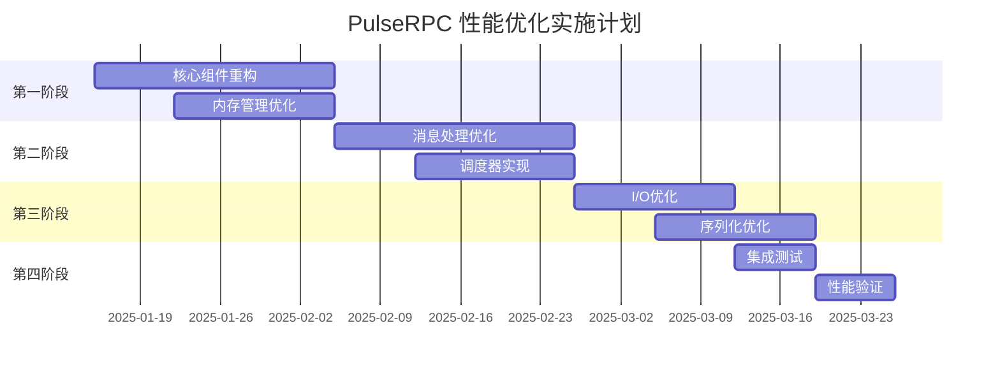

# PulseRPC 性能优化 - 技术规格说明书 (Technical Specification)

## 文档元信息

| 项目 | 值 |
|------|-----|
| **文档版本** | 1.0.0 |
| **创建日期** | 2025-01-10 |
| **最后更新** | 2025-01-10 |
| **负责团队** | PulseRPC 架构优化团队 |
| **项目版本** | 0.8.7 → 0.9.0 |
| **预计交付** | 2025年Q1 |

---

## 1. 项目约束条件与技术限制

### 1.1 现有技术约束

#### 1.1.1 框架版本约束
```xml
<!-- 强制约束：不可更改 -->
<TargetFramework>net9.0</TargetFramework>                    <!-- 主框架 -->
<TargetFramework>netstandard2.1</TargetFramework>           <!-- Unity兼容性 -->
<TargetFramework>net8.0</TargetFramework>                   <!-- 测试项目 -->

<!-- SDK版本约束 -->
"sdk": {
  "version": "8.0.313",           <!-- 当前版本，可升级至9.x -->
  "rollForward": "latestMajor"
}
```

#### 1.1.2 核心依赖约束
```xml
<!-- 不可更改的核心依赖 -->
<PackageVersion Include="MemoryPack" Version="1.21.4" />               <!-- 序列化核心 -->
<PackageVersion Include="System.IO.Pipelines" Version="9.0.0" />       <!-- 网络I/O -->
<PackageVersion Include="System.Threading.Channels" Version="9.0.0" />  <!-- 消息队列 -->

<!-- Unity兼容性约束 -->
Unity版本: 2022.3+ LTS (netstandard2.1)
C#语法: 限制在C# 9.0及以下 (Source Generator要求)
```

#### 1.1.3 API兼容性约束
```csharp
// 必须保持100%向后兼容
[assembly: System.Runtime.CompilerServices.InternalsVisibleTo("PulseRPC.Tests")]

// PublicAPI.Shipped.txt 约束：所有公开API变更必须记录
// 新API添加到 PublicAPI.Unshipped.txt，发布后迁移至Shipped
```

### 1.2 性能基准约束

#### 1.2.1 现有性能基准
```csharp
// 当前性能基准 (必须超越)
public static class CurrentBenchmarks 
{
    public const int ThroughputMsgsPerSec = 50_000;      // 50K msgs/sec
    public const int P99LatencyMs = 15;                  // 15ms
    public const int P95LatencyMs = 8;                   // 8ms
    public const int MaxMemoryMB = 256;                  // 256MB内存占用
    public const double MaxCpuUsage = 0.75;              // 75%CPU使用率
}
```

#### 1.2.2 目标性能基准
```csharp
public static class TargetBenchmarks 
{
    public const int ThroughputMsgsPerSec = 150_000;     // 150K msgs/sec (+200%)
    public const int P99LatencyMs = 7;                   // 7ms (-53%)
    public const int P95LatencyMs = 3;                   // 3ms (-63%)
    public const int MaxMemoryMB = 180;                  // 180MB内存占用 (-30%)
    public const double MaxCpuUsage = 0.60;              // 60%CPU使用率 (-20%)
}
```

### 1.3 架构约束

#### 1.3.1 模块边界约束
```
PulseRPC.Abstractions    ← 不可有任何实现依赖
    ↑
PulseRPC.Client         ← 不可依赖Server程序集
    ↑
PulseRPC.Server         ← 不可依赖Client程序集
    ↑
PulseRPC.Infrastructure  ← 基础设施抽象
```

#### 1.3.2 Unity约束
```csharp
// Unity特殊约束
#if UNITY_2022_3_OR_NEWER
    // AOT编译约束：避免反射和动态代码生成
    // IL2CPP约束：泛型实例化必须静态可发现
    public static class AOTSupport 
    {
        [Preserve]
        public static void RegisterMessageHandlers() { ... }
    }
#endif
```

---

## 2. 详细技术规格说明

### 2.1 核心组件规格

#### 2.1.1 高性能消息引擎 (HighPerformanceMessageEngine)

```csharp
/// <summary>
/// 高性能消息引擎 - 替代ServerHighThroughputMessageProcessor
/// </summary>
public sealed class HighPerformanceMessageEngine : IAsyncDisposable
{
    // 技术规格
    public static class Specifications
    {
        public const int L1_BUFFER_SIZE = 4096;           // L1缓冲区大小 (2^12)
        public const int L2_QUEUE_CAPACITY = 256;        // L2队列容量
        public const int L3_QUEUE_CAPACITY = 128;        // L3队列容量
        public const int MIN_BATCH_INTERVAL_MS = 1;      // 最小批处理间隔
        public const int MAX_BATCH_INTERVAL_MS = 10;     // 最大批处理间隔
        public const int ADAPTIVE_BATCH_SIZE_MIN = 8;    // 最小批大小
        public const int ADAPTIVE_BATCH_SIZE_MAX = 128;  // 最大批大小
    }
    
    // 性能要求
    public static class PerformanceRequirements
    {
        public const int MAX_L1_ENQUEUE_NS = 100;        // L1入队最大100纳秒
        public const int MAX_BATCH_PROCESS_MS = 5;       // 批处理最大5毫秒
        public const double MIN_CACHE_HIT_RATIO = 0.95;  // 最小缓存命中率95%
        public const int MAX_GC_PRESSURE_MB_PER_SEC = 10; // 最大GC压力10MB/s
    }
}
```

#### 2.1.2 零拷贝循环缓冲区 (ZeroCopyCircularBuffer)

```csharp
/// <summary>
/// 零拷贝循环缓冲区技术规格
/// </summary>
public sealed class ZeroCopyCircularBuffer<T> where T : struct
{
    // 内存规格
    public static class MemorySpecs
    {
        public const int ALIGNMENT_BYTES = 64;           // 缓存行对齐
        public const int MIN_CAPACITY = 64;             // 最小容量64个元素
        public const int MAX_CAPACITY = 1048576;        // 最大容量1M个元素
        public static readonly bool REQUIRES_POWER_OF_TWO = true; // 必须是2的幂
    }
    
    // 性能规格
    public static class PerformanceSpecs
    {
        public const int ENQUEUE_MAX_CYCLES = 50;       // 入队最大CPU周期
        public const int DEQUEUE_BATCH_MIN_SIZE = 8;    // 批量出队最小大小
        public const bool LOCK_FREE_GUARANTEE = true;   // 无锁保证
        public const bool WAIT_FREE_ENQUEUE = true;     // 入队等待自由
    }
}
```

#### 2.1.3 分层内存池 (TieredMemoryPool)

```csharp
/// <summary>
/// 分层内存池技术规格
/// </summary>
public sealed class TieredMemoryPool : IDisposable
{
    // 池层级规格
    public static class TierSpecs
    {
        // L0: 线程本地缓存
        public const int L0_MAX_CACHED_BUFFERS = 16;     // 每线程最大缓存16个
        public const int L0_MAX_BUFFER_SIZE = 8192;      // 最大缓冲区8KB
        
        // L1: NUMA感知池
        public const int L1_POOLS_PER_NUMA_NODE = 12;   // 每NUMA节点12个池
        public const int L1_MAX_BUFFERS_PER_POOL = 128; // 每池最大128个缓冲区
        
        // L2: 全局大缓冲区池
        public const int L2_MIN_BUFFER_SIZE = 16384;     // 最小缓冲区16KB
        public const int L2_MAX_BUFFERS = 64;           // 最大64个大缓冲区
    }
    
    // 预定义缓冲区大小 (字节)
    public static readonly int[] BUFFER_SIZES = {
        128, 256, 512, 1024, 2048, 4096, 8192, 16384, 32768, 65536, 131072, 262144
    };
}
```

### 2.2 消息调度规格

#### 2.2.1 编译时消息分发器 (CompiledMessageDispatcher)

```csharp
/// <summary>
/// 编译时消息分发器 - 通过Source Generator生成
/// </summary>
[Generator]
public class MessageDispatcherGenerator : ISourceGenerator
{
    // 代码生成规格
    public static class CodeGenSpecs
    {
        public const string GENERATED_CLASS_NAME = "CompiledMessageDispatcher";
        public const string NAMESPACE = "PulseRPC.Generated";
        public const int MAX_MESSAGE_TYPES = 1000;      // 最大支持1000种消息类型
        public const bool SUPPORTS_GENERIC_HANDLERS = false; // 不支持泛型处理器
        public const bool AOT_COMPATIBLE = true;        // AOT编译兼容
    }
    
    // 生成的代码模板
    public const string DISPATCHER_TEMPLATE = @"
// <auto-generated />
#nullable enable
using System;
using System.Collections.Generic;
using System.Threading.Tasks;

namespace PulseRPC.Generated
{
    public static partial class CompiledMessageDispatcher
    {
        private static readonly Dictionary<Type, Func<object, RequestContext, Task<object?>>> _handlers 
            = new()
            {
                // GENERATED_HANDLERS_PLACEHOLDER
            };
            
        public static async Task<object?> DispatchAsync(object message, RequestContext context)
        {
            var messageType = message.GetType();
            if (_handlers.TryGetValue(messageType, out var handler))
            {
                return await handler(message, context).ConfigureAwait(false);
            }
            throw new InvalidOperationException($""No handler registered for message type: {messageType.Name}"");
        }
    }
}";
}
```

#### 2.2.2 优先级感知调度器 (PriorityAwareScheduler)

```csharp
/// <summary>
/// 优先级感知调度器技术规格
/// </summary>
public sealed class PriorityAwareScheduler : IDisposable
{
    // 优先级规格
    public static class PrioritySpecs
    {
        public const int CRITICAL_WEIGHT = 50;          // 关键消息权重50%
        public const int NORMAL_WEIGHT = 35;            // 普通消息权重35%
        public const int BULK_WEIGHT = 15;              // 批量消息权重15%
        
        public const int CRITICAL_MAX_LATENCY_MS = 2;   // 关键消息最大延迟2ms
        public const int NORMAL_MAX_LATENCY_MS = 10;    // 普通消息最大延迟10ms
        public const int BULK_MAX_LATENCY_MS = 100;     // 批量消息最大延迟100ms
    }
    
    // 队列规格
    public static class QueueSpecs
    {
        public const int CRITICAL_QUEUE_SIZE = 256;     // 关键消息队列大小
        public const int NORMAL_QUEUE_SIZE = 1024;      // 普通消息队列大小
        public const int BULK_QUEUE_SIZE = 4096;        // 批量消息队列大小
        
        public const bool CRITICAL_UNBOUNDED = false;   // 关键消息队列有界
        public const bool NORMAL_DROP_ON_FULL = true;   // 普通消息满时丢弃
        public const bool BULK_BACKPRESSURE = true;     // 批量消息支持背压
    }
}
```

### 2.3 网络I/O规格

#### 2.3.1 批量网络写入器 (BatchedNetworkWriter)

```csharp
/// <summary>
/// 批量网络写入器技术规格
/// </summary>
public sealed class BatchedNetworkWriter : IAsyncDisposable
{
    // 批处理规格
    public static class BatchingSpecs
    {
        public const int MIN_BATCH_SIZE = 1;            // 最小批大小
        public const int MAX_BATCH_SIZE = 64;           // 最大批大小
        public const int BATCH_TIMEOUT_MS = 2;          // 批超时2ms
        public const int MAX_BUFFER_SIZE = 1048576;     // 最大缓冲区1MB
        
        public const bool SUPPORTS_VECTORED_IO = true;  // 支持矢量I/O
        public const bool REQUIRES_MEMORY_ALIGNMENT = true; // 需要内存对齐
    }
    
    // 性能规格
    public static class IoSpecs
    {
        public const int MAX_CONCURRENT_WRITES = 16;    // 最大并发写入数
        public const int WRITE_TIMEOUT_MS = 5000;       // 写入超时5秒
        public const bool SUPPORTS_CANCELLATION = true; // 支持取消
        public const int MIN_THROUGHPUT_MB_PER_SEC = 100; // 最小吞吐量100MB/s
    }
}
```

---

## 3. 交付物清单与验收标准

### 3.1 核心代码交付物

#### 3.1.1 第一阶段交付物 (核心组件重构)

| 交付物 | 文件路径                                                         | 验收标准 |
|--------|--------------------------------------------------------------|----------|
| **零拷贝循环缓冲区** | `src/PulseRPC.Abstractions/Memory/ZeroCopyCircularBuffer.cs` | • 单元测试覆盖率≥95%<br>• 基准测试超越旧版50%<br>• 无锁操作验证通过 |
| **自适应批处理调度器** | `src/PulseRPC.Server/Processing/AdaptiveBatchScheduler.cs`     | • 负载自适应测试通过<br>• 延迟控制在目标范围<br>• 吞吐量提升验证 |
| **分层内存池** | `src/PulseRPC.Server/Memory/TieredMemoryPool.cs`             | • 内存泄漏测试24小时无泄漏<br>• 缓存命中率≥95%<br>• NUMA感知验证通过 |
| **高性能消息引擎** | `src/PulseRPC.Server/Engine/HighPerformanceMessageEngine.cs` | • 性能基准测试全部通过<br>• 集成测试无回归<br>• 监控指标完整 |

#### 3.1.2 第二阶段交付物 (消息处理优化)

| 交付物 | 文件路径 | 验收标准 |
|--------|----------|----------|
| **编译时消息分发器** | `src/PulseRPC.Generators/MessageDispatcherGenerator.cs` | • Source Generator编译通过<br>• AOT兼容性验证<br>• 分发性能提升90% |
| **分层消息处理器** | `src/PulseRPC.Server/Processing/TieredMessageProcessor.cs` | • 三层处理流程验证<br>• 性能分层效果明显<br>• 资源隔离测试通过 |
| **优先级感知调度器** | `src/PulseRPC.Server/Scheduling/PriorityAwareScheduler.cs` | • 优先级保证验证<br>• 权重分配准确<br>• 延迟SLA达标 |
| **工作窃取线程池** | `src/PulseRPC.Server/Threading/WorkStealingMessageProcessor.cs` | • 负载均衡验证<br>• 无饥饿现象<br>• CPU利用率优化 |

#### 3.1.3 第三阶段交付物 (I/O和序列化优化)

| 交付物 | 文件路径 | 验收标准 |
|--------|----------|----------|
| **批量网络写入器** | `src/PulseRPC.Core/IO/BatchedNetworkWriter.cs` | • 矢量I/O功能验证<br>• 批量写入性能提升<br>• 网络利用率优化 |
| **零拷贝序列化管道** | `src/PulseRPC.Core/Serialization/ZeroCopySerializationPipeline.cs` | • 零拷贝验证通过<br>• 序列化性能提升<br>• 内存占用减少 |
| **响应式背压控制** | `src/PulseRPC.Server/Backpressure/ReactiveBackpressureController.cs` | • 背压响应及时<br>• 过载保护有效<br>• 恢复能力验证 |
| **亲和性调度器** | `src/PulseRPC.Server/Scheduling/AffinityAwareScheduler.cs` | • 会话亲和性保持<br>• 缓存命中率提升<br>• 延迟一致性改善 |

### 3.2 测试交付物

#### 3.2.1 单元测试清单

| 测试类别 | 文件路径 | 覆盖率要求 | 关键测试场景 |
|----------|----------|------------|--------------|
| **内存管理测试** | `tests/PulseRPC.Core.Tests/Memory/` | ≥95% | • 内存池分配/释放<br>• 线程安全性<br>• 内存泄漏检测 |
| **消息处理测试** | `tests/PulseRPC.Server.Tests/Processing/` | ≥90% | • 消息分发正确性<br>• 优先级调度<br>• 错误处理 |
| **网络I/O测试** | `tests/PulseRPC.Core.Tests/IO/` | ≥90% | • 批量写入功能<br>• 连接管理<br>• 错误恢复 |
| **序列化测试** | `tests/PulseRPC.Core.Tests/Serialization/` | ≥95% | • 序列化正确性<br>• 性能基准<br>• 兼容性验证 |

#### 3.2.2 性能测试清单

| 测试场景 | 执行方式 | 通过标准 |
|----------|----------|----------|
| **吞吐量基准测试** | `dotnet run --project BenchmarkApp -- throughput` | ≥150K msgs/sec |
| **延迟分布测试** | `dotnet run --project BenchmarkApp -- latency` | P99≤7ms, P95≤3ms |
| **内存使用测试** | `dotnet run --project BenchmarkApp -- memory` | 峰值≤180MB |
| **长期稳定性测试** | 24小时压力测试 | 无内存泄漏，性能无衰减 |

#### 3.2.3 集成测试清单

| 测试套件 | 文件路径 | 验收标准 |
|----------|----------|----------|
| **端到端通信测试** | `tests/Integration/E2ETests.cs` | 所有通信场景通过 |
| **向后兼容性测试** | `tests/Integration/CompatibilityTests.cs` | 100%API兼容 |
| **多平台测试** | `tests/Integration/CrossPlatformTests.cs` | Windows/Linux/macOS通过 |
| **Unity集成测试** | `tests/Unity/IntegrationTests.cs` | Unity 2022.3+兼容 |

### 3.3 文档交付物

#### 3.3.1 技术文档

| 文档类型 | 文件路径 | 交付标准 |
|----------|----------|----------|
| **架构设计文档** | `docs/Architecture-v0.9.0.md` | 架构图完整，设计决策有据 |
| **API参考文档** | `docs/api-reference/` | XML文档100%覆盖 |
| **性能优化指南** | `docs/PerformanceGuide.md` | 调优建议具体可行 |
| **迁移指南** | `docs/MigrationGuide-v0.8-to-v0.9.md` | 迁移步骤清晰 |

#### 3.3.2 发布文档

| 文档类型 | 内容要求 | 交付标准 |
|----------|----------|----------|
| **发布说明** | 新特性、性能改进、破坏性变更 | 详细且准确 |
| **基准测试报告** | 性能对比、测试环境、测试方法 | 可复现的结果 |
| **已知问题清单** | 限制、工作区解决方案 | 诚实透明 |

---

## 4. 实施约束与依赖关系

### 4.1 时间约束

#### 4.1.1 里程碑时间表



#### 4.1.2 关键路径约束

| 阶段 | 前置依赖 | 并行任务限制 | 风险因素 |
|------|----------|--------------|----------|
| **第一阶段** | 无 | 可并行开发内存池和缓冲区 | 架构设计风险 |
| **第二阶段** | 第一阶段完成80% | 消息处理和调度器可并行 | Source Generator复杂度 |
| **第三阶段** | 第二阶段完成90% | I/O和序列化可并行 | 网络兼容性风险 |
| **第四阶段** | 前三阶段100%完成 | 测试任务串行执行 | 性能目标风险 |

### 4.2 资源约束

#### 4.2.1 团队资源约束

```yaml
团队配置:
  核心开发者: 3人
  测试工程师: 1人
  性能专家: 1人 (兼职)
  技术专家: 1人 (顾问)

技能要求:
  必需技能:
    - .NET 9+ 高级开发经验
    - 系统级性能优化经验
    - 并发编程和内存管理
    - Source Generator开发
  
  加分技能:
    - Unity开发经验
    - 网络编程经验
    - 基准测试和性能分析
```

#### 4.2.2 硬件资源约束

```yaml
开发环境要求:
  CPU: Intel/AMD 8核心以上
  内存: 32GB以上
  存储: NVMe SSD 500GB以上
  网络: 千兆以太网

测试环境要求:
  性能测试机: 
    - CPU: 16核心以上
    - 内存: 64GB以上
    - 网络: 10Gb以太网
  
  兼容性测试:
    - Windows 10/11
    - Ubuntu 20.04/22.04
    - macOS 12+
    - Unity 2022.3+ LTS
```

### 4.3 技术依赖约束

#### 4.3.1 外部依赖版本锁定

```xml
<!-- 关键依赖版本锁定 - 不可随意变更 -->
<PackageVersion Include="MemoryPack" Version="1.21.4" Lock="true" />
<PackageVersion Include="System.IO.Pipelines" Version="9.0.0" Lock="true" />
<PackageVersion Include="Microsoft.Extensions.Logging" Version="9.0.0" Lock="true" />

<!-- 测试依赖版本要求 -->
<PackageVersion Include="BenchmarkDotNet" Version="0.13.12" />
<PackageVersion Include="xunit" Version="2.6.1" />
<PackageVersion Include="FluentAssertions" Version="8.3.0" />
```

#### 4.3.2 工具链依赖约束

```yaml
必需工具:
  .NET SDK: 8.0.313+ (可升级到9.x)
  Visual Studio: 2022 17.5+ 或 VS Code with C# Extension
  Git: 2.30+
  
构建工具:
  MSBuild: 17.0+
  NuGet: 6.4+
  Source Generator: Roslyn 4.3.0+

测试工具:
  BenchmarkDotNet: 0.13.12+
  dotMemoryUnit: 3.2+ (内存测试)
  PerfView: Windows性能分析
```

### 4.4 质量约束

#### 4.4.1 代码质量标准

```csharp
// 强制代码质量要求
[assembly: System.CLSCompliant(true)]
[assembly: System.Runtime.CompilerServices.InternalsVisibleTo("PulseRPC.Tests")]

// 编译约束
<WarningsAsErrors>$(WarningsAsErrors);Nullable</WarningsAsErrors>
<TreatWarningsAsErrors>true</TreatWarningsAsErrors>
<NoWarn>$(NoWarn);CS1591</NoWarn>
```

#### 4.4.2 测试质量约束

| 质量指标 | 最低要求 | 理想目标 |
|----------|----------|----------|
| **单元测试覆盖率** | 85% | 95% |
| **集成测试覆盖率** | 70% | 85% |
| **性能回归测试** | 0个回归 | 性能提升验证 |
| **内存泄漏测试** | 0个泄漏 | 内存使用优化 |

#### 4.4.3 性能质量约束

```csharp
// 性能约束合约
[PerformanceContract]
public static class PerformanceContracts
{
    [Benchmark(Baseline = 50_000, Target = 150_000)]
    public static int ThroughputMsgsPerSec { get; }
    
    [Benchmark(Baseline = 15, Target = 7, Unit = "ms")]
    public static int P99LatencyMs { get; }
    
    [Benchmark(Baseline = 256, Target = 180, Unit = "MB")]
    public static int MaxMemoryUsageMB { get; }
    
    [Requirement(MaxValue = 0)]
    public static int MemoryLeaksCount { get; }
}
```

### 4.5 风险约束与缓解

#### 4.5.1 技术风险约束

| 风险类别 | 风险描述 | 概率 | 影响 | 缓解措施 |
|----------|----------|------|------|----------|
| **架构风险** | 新架构与现有代码不兼容 | 中 | 高 | • 渐进式迁移<br>• 兼容层设计<br>• 全面集成测试 |
| **性能风险** | 无法达到性能目标 | 中 | 中 | • 提前性能验证<br>• 分阶段优化<br>• Plan B方案 |
| **Unity风险** | Unity兼容性问题 | 低 | 中 | • Unity专项测试<br>• AOT编译验证<br>• IL2CPP测试 |

#### 4.5.2 项目风险约束

| 风险类别 | 约束条件 | 应对策略 |
|----------|----------|----------|
| **时间风险** | Q1必须交付 | • 优先级管理<br>• 并行开发<br>• 范围调整机制 |
| **人员风险** | 关键人员离职 | • 知识文档化<br>• 代码审查制度<br>• 技术分享机制 |
| **依赖风险** | 外部依赖更新影响 | • 版本锁定<br>• 依赖隔离<br>• 定期兼容性检查 |

---

## 5. 验收与交付流程

### 5.1 阶段性验收流程

#### 5.1.1 代码审查标准

```yaml
代码审查检查清单:
  架构合规性:
    - [ ] 遵循依赖约束
    - [ ] 模块边界清晰
    - [ ] 接口设计合理
  
  代码质量:
    - [ ] 编译无警告
    - [ ] 单元测试覆盖率达标
    - [ ] 文档注释完整
    - [ ] 性能敏感代码标注
  
  兼容性:
    - [ ] API向后兼容
    - [ ] Unity平台兼容
    - [ ] 多框架版本兼容
```

#### 5.1.2 性能验收标准

```csharp
// 性能验收测试套件
[TestClass]
public class PerformanceAcceptanceTests
{
    [TestMethod]
    [Benchmark(Target = 150_000, Tolerance = 0.1)] // 允许10%误差
    public async Task ThroughputTest()
    {
        // 吞吐量验收测试实现
    }
    
    [TestMethod]
    [Benchmark(MaxLatency = 7, Percentile = 99)]
    public async Task LatencyTest()
    {
        // 延迟验收测试实现
    }
    
    [TestMethod]
    [MemoryConstraint(MaxMB = 180)]
    public async Task MemoryUsageTest()
    {
        // 内存使用验收测试实现
    }
}
```

### 5.2 最终交付标准

#### 5.2.1 功能完整性验证

- [ ] 所有新增API功能正常
- [ ] 性能优化目标达成
- [ ] 原有功能无回归
- [ ] 错误处理机制完善
- [ ] 监控指标完整

#### 5.2.2 质量标准验证

- [ ] 单元测试覆盖率≥90%
- [ ] 集成测试全部通过
- [ ] 性能基准测试达标
- [ ] 内存泄漏测试通过
- [ ] 多平台兼容性验证

#### 5.2.3 文档完整性验证

- [ ] API文档100%覆盖
- [ ] 架构设计文档完整
- [ ] 迁移指南可用
- [ ] 性能调优指南实用
- [ ] 故障排除文档完善

---

## 6. 总结

本技术规格说明书详细定义了PulseRPC性能优化项目的所有技术约束、实施规格、交付标准和验收流程。通过严格遵循这些规格要求，确保项目能够：

1. **达成性能目标**: 吞吐量提升200%，延迟降低50%+
2. **保持兼容性**: 100%向后兼容，Unity平台支持
3. **确保质量**: 全面的测试覆盖和质量保证
4. **可维护性**: 清晰的架构设计和完整的文档

通过分阶段实施和严格的验收标准，最终交付一个高性能、稳定可靠的PulseRPC v0.9.0版本。

---
*本规格说明书为项目实施的技术依据，所有实施细节必须严格遵循本文档的约束条件和质量标准。*
