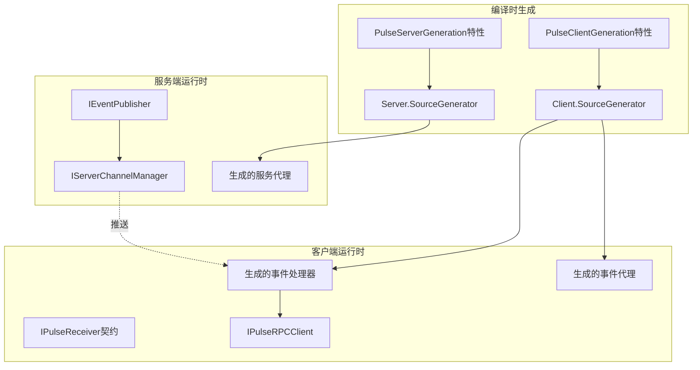

# IPulseReceiver SourceGenerator 通知系统重构计划

**日期**: 2025-09-18
**评审范围**: 基于SourceGenerator的IPulseReceiver通知系统完整重构
**目标**: 高性能、易用性、零反射的通知系统
**状态**: 设计阶段

## 一、现状分析

### 1.1 当前架构特点

#### SourceGenerator驱动架构
- **客户端SourceGenerator**: `PulseRPC.Client.SourceGenerator` 负责生成事件处理代理
- **服务端SourceGenerator**: `PulseRPC.Server.SourceGenerator` 负责生成服务分发器
- **零反射设计**: 编译时生成强类型代码，避免运行时反射开销
- **特性驱动**: 通过`[PulseClientGeneration]`和`[PulseServerGeneration]`特性配置生成

#### 核心接口职责
- **IPulseReceiver**: 统一的事件接收契约标记接口
- **具体事件接口**: 如`IChatHubReceiver`，继承`IPulseReceiver`并定义具体事件方法
- **IEventPublisher**: 服务端事件发布接口，使用`IServerChannelManager`进行分发

### 1.2 SourceGenerator工作机制



## 二、优势分析

### 2.1 性能优势 ✅

1. **零反射开销**
   - 编译时生成强类型代理，避免运行时Type查找
   - 方法调用直接绑定，无需通过Reflection.Invoke
   - 序列化路径预优化，无需运行时类型分析

2. **编译时优化**
   ```csharp
   // 生成的高性能事件处理器
   public class ChatHubReceiverHandler : IChatHubReceiverHandler
   {
       public async Task<ISubscriptionToken> Subscribe(IChatHubReceiver subscriber)
       {
           // 直接强类型绑定，无反射
           var token = await _client.RegisterEventListenerAsync(subscriber);
           return token;
       }
   }
   ```

3. **静态路由表**
   - 编译时构建方法路由映射
   - 预计算哈希值，O(1)方法查找
   - 避免运行时字符串比较

### 2.2 易用性优势 ✅

1. **声明式配置**
   ```csharp
   [PulseClientGeneration(typeof(IChatHubReceiver))]
   public partial class ClientConfiguration { }
   ```

2. **智能API生成**
   ```csharp
   // 自动生成的扩展方法
   var token = await client.RegisterEventListenerAsync(chatReceiver);
   var token = await client.RegisterGameEventListener(gameReceiver); // 预设配置
   ```

3. **编译时错误检查**
   - 接口不匹配在编译时发现
   - 类型安全保证
   - IDE智能提示支持

## 三、核心问题与改进方案

### 3.1 问题一：订阅管理缺乏细粒度控制

#### 当前问题
```csharp
// 当前只能全量广播到所有已认证连接
var channels = _channelManager.GetAuthenticatedChannels();
foreach (var channel in channels)
{
    await channel.SendAsync(eventDataBytes, CancellationToken.None);
}
```

#### 解决方案：生成事件订阅管理器
```csharp
// 在SourceGenerator中生成订阅管理器
[Generator]
public class EventSubscriptionGenerator : IIncrementalGenerator
{
    public void Initialize(IncrementalGeneratorInitializationContext context)
    {
        // 扫描所有IPulseReceiver接口，生成订阅管理器
        var eventInterfaces = context.SyntaxProvider
            .CreateSyntaxProvider(
                predicate: static (s, _) => s is InterfaceDeclarationSyntax,
                transform: GetEventInterfaces)
            .Where(i => i != null);

        context.RegisterSourceOutput(eventInterfaces.Collect(), GenerateSubscriptionManager);
    }

    private void GenerateSubscriptionManager(SourceProductionContext context,
        ImmutableArray<EventInterfaceInfo> interfaces)
    {
        var code = GenerateSubscriptionManagerCode(interfaces);
        context.AddSource("EventSubscriptionManager.g.cs", code);
    }
}

// 生成的订阅管理器
public class GeneratedEventSubscriptionManager : IEventSubscriptionManager
{
    private readonly ConcurrentDictionary<string, HashSet<string>> _eventSubscriptions = new();
    private readonly ConcurrentDictionary<string, EventSubscriptionMetadata> _subscriptionMetadata = new();

    public async Task SubscribeAsync(string connectionId, string eventName,
        EventSubscriptionOptions? options = null)
    {
        var subscriptions = _eventSubscriptions.GetOrAdd(eventName, _ => new HashSet<string>());
        lock (subscriptions)
        {
            subscriptions.Add(connectionId);
        }

        if (options != null)
        {
            _subscriptionMetadata[GetSubscriptionKey(connectionId, eventName)] =
                new EventSubscriptionMetadata(options);
        }
    }

    public IReadOnlyList<string> GetSubscribers(string eventName)
    {
        return _eventSubscriptions.TryGetValue(eventName, out var subscribers)
            ? subscribers.ToList()
            : Array.Empty<string>();
    }
}
```

### 3.2 问题二：事件路由缺乏智能分发

#### 解决方案：生成智能事件路由器
```csharp
// 生成基于接口的智能路由
public static class GeneratedEventRouter
{
    private static readonly Dictionary<string, EventRouterDelegate> _routerMap = new()
    {
        ["IChatHubReceiver.OnJoin"] = (eventData, context) =>
        {
            // 房间相关事件只发送给同房间用户
            if (context.RoomId != null)
                return _channelManager.GetChannelsByRoom(context.RoomId);
            return _channelManager.GetAuthenticatedChannels();
        },
        ["IGameEventReceiver.OnPlayerAction"] = (eventData, context) =>
        {
            // 游戏事件基于区域分发
            if (context.Region != null)
                return _channelManager.GetChannelsByRegion(context.Region);
            return Array.Empty<IServerChannel>();
        }
    };

    public static async Task<int> RouteEventAsync<T>(string eventName, T eventData,
        EventRoutingContext context)
    {
        var routerKey = $"{typeof(T).Name}.{eventName}";
        if (_routerMap.TryGetValue(routerKey, out var router))
        {
            var targetChannels = router(eventData, context);
            return await PublishToChannelsAsync(targetChannels, eventName, eventData);
        }

        // 默认广播
        var allChannels = _channelManager.GetAuthenticatedChannels();
        return await PublishToChannelsAsync(allChannels, eventName, eventData);
    }
}
```

### 3.3 问题三：性能监控和诊断不足

#### 解决方案：生成性能监控代码
```csharp
// 在SourceGenerator中生成性能监控
public static class GeneratedEventMetrics
{
    private static readonly Counter<long> _eventPublishCounter =
        Meter.CreateCounter<long>("pulse_events_published_total");
    private static readonly Histogram<double> _eventPublishDuration =
        Meter.CreateHistogram<double>("pulse_event_publish_duration_ms");

    public static async Task<int> PublishWithMetricsAsync<T>(string eventName, T eventData,
        IEnumerable<IServerChannel> channels)
    {
        using var activity = Activity.StartActivity($"PublishEvent.{eventName}");
        var stopwatch = Stopwatch.StartNew();

        try
        {
            var tasks = channels.Select(async channel =>
            {
                try
                {
                    await channel.SendAsync(SerializeEvent(eventData), CancellationToken.None);
                    return true;
                }
                catch (Exception ex)
                {
                    activity?.SetStatus(ActivityStatusCode.Error, ex.Message);
                    return false;
                }
            });

            var results = await Task.WhenAll(tasks);
            var successCount = results.Count(r => r);

            _eventPublishCounter.Add(successCount,
                new TagList { ["event_name"] = eventName, ["status"] = "success" });
            _eventPublishCounter.Add(results.Length - successCount,
                new TagList { ["event_name"] = eventName, ["status"] = "failed" });

            return successCount;
        }
        finally
        {
            stopwatch.Stop();
            _eventPublishDuration.Record(stopwatch.Elapsed.TotalMilliseconds,
                new TagList { ["event_name"] = eventName });
        }
    }
}
```

## 四、客户端使用规范

### 4.1 接口定义规范

#### 4.1.1 事件接收器接口规范
```csharp
/// <summary>
/// 事件接收器接口必须继承IPulseReceiver
/// 方法命名：On + 事件名称
/// 支持同步和异步方法
/// </summary>
[Channel("GameChannel")]
public interface IGameEventReceiver : IPulseReceiver
{
    /// <summary>
    /// 玩家加入事件 - 无返回值的通知类事件
    /// </summary>
    /// <param name="playerInfo">玩家信息</param>
    void OnPlayerJoin(PlayerInfo playerInfo);

    /// <summary>
    /// 游戏状态变更 - 带返回值的交互类事件
    /// </summary>
    /// <param name="newState">新状态</param>
    /// <returns>客户端是否确认状态变更</returns>
    Task<bool> OnGameStateChanged(GameState newState);

    /// <summary>
    /// 实时数据推送 - 高频事件，使用ValueTask优化
    /// </summary>
    /// <param name="data">实时数据</param>
    ValueTask OnRealtimeData(RealtimeData data);

    /// <summary>
    /// 批量事件处理 - 支持批量数据推送
    /// </summary>
    /// <param name="events">事件列表</param>
    Task OnBatchEvents(IReadOnlyList<GameEvent> events);
}
```

#### 4.1.2 数据类型规范
```csharp
/// <summary>
/// 事件数据必须标记为MemoryPackable以支持高性能序列化
/// </summary>
[MemoryPackable]
public partial struct PlayerInfo
{
    [MemoryPackOrder(0)]
    public string PlayerId { get; set; }

    [MemoryPackOrder(1)]
    public string PlayerName { get; set; }

    [MemoryPackOrder(2)]
    public Vector3 Position { get; set; }

    [MemoryPackOrder(3)]
    public PlayerState State { get; set; }
}

/// <summary>
/// 枚举类型直接支持，无需特殊标记
/// </summary>
public enum PlayerState
{
    Online,
    Away,
    InGame,
    Offline
}
```

### 4.2 客户端注册规范

#### 4.2.1 配置类定义
```csharp
/// <summary>
/// 客户端配置类 - 使用PulseClientGeneration特性注册事件接口
/// 一个配置类可以注册多个事件接口
/// </summary>
[PulseClientGeneration(typeof(IGameEventReceiver))]
[PulseClientGeneration(typeof(IChatEventReceiver))]
[PulseClientGeneration(typeof(ISystemEventReceiver))]
public partial class GameClientConfiguration
{
    // 配置类可以为空，SourceGenerator会自动生成代理代码
    // 也可以添加自定义配置属性
    public static TimeSpan DefaultTimeout => TimeSpan.FromSeconds(30);
    public static int DefaultRetryCount => 3;
}
```

#### 4.2.2 事件处理器实现
```csharp
/// <summary>
/// 事件处理器实现类
/// 推荐：一个类实现一个事件接口，保持单一职责
/// </summary>
public class GameEventHandler : IGameEventReceiver
{
    private readonly ILogger<GameEventHandler> _logger;
    private readonly IGameStateManager _gameStateManager;

    public GameEventHandler(ILogger<GameEventHandler> logger,
        IGameStateManager gameStateManager)
    {
        _logger = logger;
        _gameStateManager = gameStateManager;
    }

    public void OnPlayerJoin(PlayerInfo playerInfo)
    {
        _logger.LogInformation("玩家 {PlayerName} 加入游戏", playerInfo.PlayerName);
        _gameStateManager.AddPlayer(playerInfo);
    }

    public async Task<bool> OnGameStateChanged(GameState newState)
    {
        try
        {
            await _gameStateManager.ChangeStateAsync(newState);
            return true;
        }
        catch (Exception ex)
        {
            _logger.LogError(ex, "游戏状态变更失败");
            return false;
        }
    }

    public ValueTask OnRealtimeData(RealtimeData data)
    {
        // 高频事件处理，避免异步开销
        _gameStateManager.UpdateRealtimeData(data);
        return ValueTask.CompletedTask;
    }

    public async Task OnBatchEvents(IReadOnlyList<GameEvent> events)
    {
        // 批量处理，提高性能
        await _gameStateManager.ProcessBatchEventsAsync(events);
    }
}
```

### 4.3 注册和配置API

#### 4.3.1 简单注册（推荐）
```csharp
// 基本注册 - 最简单的使用方式
var gameEventHandler = new GameEventHandler(logger, gameStateManager);
var token = await client.RegisterEventListenerAsync(gameEventHandler);

// 游戏场景预设 - 低延迟，快速重试
var token = await client.RegisterGameEventListener(gameEventHandler);

// 关键业务场景预设 - 高可靠性，持久重试
var token = await client.RegisterCriticalEventListener(gameEventHandler);
```

#### 4.3.2 高级配置
```csharp
// 链式配置API - 灵活配置各种选项
var token = await client.ConfigureEventListener(gameEventHandler)
    .WithChannel("GameChannel")                    // 指定通道
    .WithErrorHandling(ErrorHandlingStrategy.RetryThenSkip)  // 错误处理策略
    .WithRetry(maxRetries: 5, delay: TimeSpan.FromSeconds(1)) // 重试配置
    .WithTimeout(TimeSpan.FromSeconds(30))         // 超时设置
    .WithPerformanceMonitoring()                   // 性能监控
    .WithPriority(EventPriority.High)             // 事件优先级
    .WithBatchSize(100)                           // 批量处理大小
    .WithErrorHandler((ex, eventName) =>          // 自定义错误处理
    {
        logger.LogError(ex, "事件 {EventName} 处理失败", eventName);
    })
    .RegisterAsync();
```

#### 4.3.3 多接口注册
```csharp
/// <summary>
/// 一个处理器类实现多个事件接口的情况
/// SourceGenerator会自动识别并注册所有实现的接口
/// </summary>
public class UnifiedEventHandler : IGameEventReceiver, IChatEventReceiver
{
    // 实现所有接口方法
}

// 自动注册所有实现的接口
var handler = new UnifiedEventHandler();
var token = await client.RegisterEventListenerAsync(handler);
```

### 4.4 性能优化最佳实践

#### 4.4.1 事件处理性能
```csharp
public class OptimizedGameEventHandler : IGameEventReceiver
{
    // 使用对象池减少GC压力
    private readonly ObjectPool<StringBuilder> _stringBuilderPool;

    // 使用内存池处理大数据
    private readonly MemoryPool<byte> _memoryPool;

    public void OnPlayerJoin(PlayerInfo playerInfo)
    {
        // 快速返回，避免阻塞事件循环
        _ = Task.Run(() => ProcessPlayerJoinAsync(playerInfo));
    }

    public ValueTask OnRealtimeData(RealtimeData data)
    {
        // 高频事件：同步处理，避免Task开销
        ProcessRealtimeDataSynchronously(data);
        return ValueTask.CompletedTask;
    }

    private async Task ProcessPlayerJoinAsync(PlayerInfo playerInfo)
    {
        // 异步处理复杂逻辑
        using var memory = _memoryPool.Rent(1024);
        // 处理逻辑...
    }
}
```

#### 4.4.2 内存管理
```csharp
/// <summary>
/// 实现IDisposable以正确清理资源
/// </summary>
public class GameEventHandler : IGameEventReceiver, IDisposable
{
    private readonly CancellationTokenSource _cancellationTokenSource = new();
    private bool _disposed;

    public async Task<bool> OnGameStateChanged(GameState newState)
    {
        // 使用cancellation token支持优雅关闭
        try
        {
            await ProcessStateChangeAsync(newState, _cancellationTokenSource.Token);
            return true;
        }
        catch (OperationCanceledException)
        {
            return false;
        }
    }

    public void Dispose()
    {
        if (!_disposed)
        {
            _cancellationTokenSource.Cancel();
            _cancellationTokenSource.Dispose();
            _disposed = true;
        }
    }
}

// 使用using确保资源清理
using var eventHandler = new GameEventHandler();
var token = await client.RegisterEventListenerAsync(eventHandler);
```

## 五、服务端使用规范

### 5.1 服务端配置规范

#### 5.1.1 配置类定义
```csharp
/// <summary>
/// 服务端配置类 - 使用PulseServerGeneration特性
/// 参数是一个标记类型，SourceGenerator会扫描该类型所在程序集的所有服务
/// </summary>
[PulseServerGeneration(typeof(IGameHub))] // 扫描IGameHub所在程序集
public partial class GameServerConfiguration
{
    // SourceGenerator会自动扫描程序集中所有IPulseHub接口
    // 并生成对应的路由表和分发器
}
```

#### 5.1.2 服务接口定义
```csharp
/// <summary>
/// 服务接口必须继承IPulseHub
/// 这些接口定义客户端可以调用的服务方法
/// </summary>
[Channel("GameChannel")]
public interface IGameHub : IPulseHub
{
    Task<bool> JoinGameAsync(JoinGameRequest request);
    Task<GameState> GetGameStateAsync();
    Task LeaveGameAsync();
}

/// <summary>
/// 事件接收器接口用于服务端向客户端推送事件
/// 与客户端的IGameEventReceiver对应
/// </summary>
[Channel("GameChannel")]
public interface IGameEventReceiver : IPulseReceiver
{
    void OnPlayerJoin(PlayerInfo playerInfo);
    Task<bool> OnGameStateChanged(GameState newState);
    ValueTask OnRealtimeData(RealtimeData data);
}
```

### 5.2 事件发布规范

#### 5.2.1 基础发布API
```csharp
/// <summary>
/// 服务端事件发布器 - SourceGenerator生成增强版本
/// </summary>
public class GameService : IGameHub
{
    private readonly IEventPublisher _eventPublisher;
    private readonly IEventSubscriptionManager _subscriptionManager;
    private readonly IGameStateManager _gameStateManager;

    public async Task<bool> JoinGameAsync(JoinGameRequest request)
    {
        var playerInfo = await _gameStateManager.AddPlayerAsync(request);

        // 基础广播 - 发送给所有已认证连接
        await _eventPublisher.PublishEventAsync("OnPlayerJoin", playerInfo);

        // 定向发布 - 只发送给房间内玩家
        var roomPlayers = await GetRoomPlayersAsync(request.RoomId);
        await _eventPublisher.PublishEventToConnectionsAsync(
            roomPlayers.Select(p => p.ConnectionId),
            "OnPlayerJoin",
            playerInfo);

        return true;
    }
}
```

#### 5.2.2 智能路由发布
```csharp
/// <summary>
/// SourceGenerator生成的智能事件发布器
/// 支持基于上下文的智能路由
/// </summary>
public static class GeneratedGameEventPublisher
{
    /// <summary>
    /// 房间事件发布 - 自动路由到房间内玩家
    /// </summary>
    public static async Task PublishRoomEventAsync<T>(string roomId, string eventName, T eventData)
    {
        var context = new EventRoutingContext
        {
            RoomId = roomId,
            Tags = { ["event_type"] = "room" }
        };

        await _eventRouter.RouteAndPublishAsync(eventName, eventData, context);
    }

    /// <summary>
    /// 区域事件发布 - 基于地理位置路由
    /// </summary>
    public static async Task PublishRegionEventAsync<T>(string region, string eventName, T eventData)
    {
        var context = new EventRoutingContext
        {
            Region = region,
            Tags = { ["event_type"] = "region" }
        };

        await _eventRouter.RouteAndPublishAsync(eventName, eventData, context);
    }

    /// <summary>
    /// 用户定向发布 - 发送给特定用户
    /// </summary>
    public static async Task PublishUserEventAsync<T>(string userId, string eventName, T eventData)
    {
        var context = new EventRoutingContext
        {
            UserId = userId,
            Tags = { ["event_type"] = "user" }
        };

        await _eventRouter.RouteAndPublishAsync(eventName, eventData, context);
    }
}

// 使用示例
public class GameService : IGameHub
{
    public async Task<bool> MovePlayerAsync(MovePlayerRequest request)
    {
        await _gameStateManager.MovePlayerAsync(request);

        // 智能路由：只发送给同区域玩家
        await GeneratedGameEventPublisher.PublishRegionEventAsync(
            request.Region,
            "OnPlayerMove",
            new PlayerMoveEvent { PlayerId = request.PlayerId, NewPosition = request.Position });

        return true;
    }
}
```

### 5.3 订阅管理规范

#### 5.3.1 动态订阅管理
```csharp
/// <summary>
/// SourceGenerator生成的订阅管理器
/// 支持运行时动态管理客户端订阅
/// </summary>
public class GameEventSubscriptionService
{
    private readonly IEventSubscriptionManager _subscriptionManager;

    /// <summary>
    /// 玩家加入房间时自动订阅房间事件
    /// </summary>
    public async Task OnPlayerJoinRoomAsync(string connectionId, string roomId)
    {
        // 订阅房间相关事件
        await _subscriptionManager.SubscribeAsync(connectionId, "OnRoomMessage",
            new EventSubscriptionOptions
            {
                Tags = { ["room_id"] = roomId },
                Priority = EventPriority.High
            });

        await _subscriptionManager.SubscribeAsync(connectionId, "OnRoomStateChanged",
            new EventSubscriptionOptions
            {
                Tags = { ["room_id"] = roomId },
                Filter = (data) => ((RoomStateChangedEvent)data).RoomId == roomId
            });
    }

    /// <summary>
    /// 玩家离开房间时自动取消订阅
    /// </summary>
    public async Task OnPlayerLeaveRoomAsync(string connectionId, string roomId)
    {
        await _subscriptionManager.UnsubscribeAsync(connectionId, "OnRoomMessage");
        await _subscriptionManager.UnsubscribeAsync(connectionId, "OnRoomStateChanged");
    }
}
```

#### 5.3.2 条件订阅
```csharp
/// <summary>
/// 基于条件的智能订阅
/// </summary>
public class ConditionalSubscriptionService
{
    /// <summary>
    /// VIP玩家订阅高优先级事件
    /// </summary>
    public async Task SubscribeVipEventsAsync(string connectionId, PlayerInfo playerInfo)
    {
        if (playerInfo.IsVip)
        {
            await _subscriptionManager.SubscribeAsync(connectionId, "OnVipReward",
                new EventSubscriptionOptions
                {
                    Priority = EventPriority.Critical,
                    Tags = { ["player_tier"] = "vip" }
                });
        }
    }

    /// <summary>
    /// 基于等级的事件订阅
    /// </summary>
    public async Task SubscribeLevelBasedEventsAsync(string connectionId, int playerLevel)
    {
        // 高级玩家订阅高级事件
        if (playerLevel >= 50)
        {
            await _subscriptionManager.SubscribeAsync(connectionId, "OnAdvancedContent",
                new EventSubscriptionOptions
                {
                    Filter = (data) => ((ContentEvent)data).RequiredLevel <= playerLevel
                });
        }
    }
}
```

### 5.4 性能优化规范

#### 5.4.1 批量处理
```csharp
/// <summary>
/// 批量事件发布器 - 优化高频事件性能
/// </summary>
public class BatchEventPublisher
{
    private readonly Channel<PendingEvent> _eventQueue =
        Channel.CreateBounded<PendingEvent>(1000);
    private readonly Timer _batchTimer;

    public BatchEventPublisher()
    {
        // 每100ms或达到50个事件时批量发送
        _batchTimer = new Timer(ProcessBatch, null,
            TimeSpan.FromMilliseconds(100),
            TimeSpan.FromMilliseconds(100));
    }

    public async Task QueueEventAsync<T>(string eventName, T eventData)
    {
        var pendingEvent = new PendingEvent(eventName, eventData);
        await _eventQueue.Writer.WriteAsync(pendingEvent);
    }

    private async void ProcessBatch(object? state)
    {
        var events = new List<PendingEvent>();

        // 收集待处理事件
        while (events.Count < 50 && _eventQueue.Reader.TryRead(out var evt))
        {
            events.Add(evt);
        }

        if (events.Count > 0)
        {
            // 按事件类型分组批量发送
            var groupedEvents = events.GroupBy(e => e.EventName);
            var tasks = groupedEvents.Select(group =>
                PublishBatchEventsAsync(group.Key, group.Select(e => e.Data)));

            await Task.WhenAll(tasks);
        }
    }

    private async Task PublishBatchEventsAsync(string eventName, IEnumerable<object> eventDataList)
    {
        var subscribers = _subscriptionManager.GetSubscribers(eventName);
        if (!subscribers.Any()) return;

        var channels = _channelManager.GetAuthenticatedChannels()
            .Where(c => subscribers.Contains(c.ConnectionId));

        // 序列化批量数据
        var batchData = new BatchEventData(eventName, eventDataList.ToList());
        var serializedData = _serializerProvider.Serialize(batchData);

        // 并行发送到所有目标通道
        var tasks = channels.Select(channel => channel.SendAsync(serializedData));
        await Task.WhenAll(tasks);
    }
}
```

#### 5.4.2 内存池化
```csharp
/// <summary>
/// 内存池化的事件发布器
/// </summary>
public class PooledEventPublisher : IEventPublisher
{
    private readonly ArrayPool<byte> _arrayPool = ArrayPool<byte>.Shared;
    private readonly ObjectPool<MemoryBufferWriter<byte>> _bufferPool;

    public async Task PublishEventAsync<T>(string eventName, T eventData)
    {
        // 从池中获取缓冲区
        var buffer = _bufferPool.Get();
        try
        {
            // 序列化到池化缓冲区
            _serializerProvider.Serialize(buffer, eventData);

            // 获取序列化数据
            var data = buffer.WrittenMemory;

            // 发布事件
            await PublishToSubscribersAsync(eventName, data);
        }
        finally
        {
            // 归还缓冲区到池中
            _bufferPool.Return(buffer);
        }
    }
}
```

## 六、高性能设计方案

### 6.1 编译时优化

#### 6.1.1 静态方法表生成
```csharp
// SourceGenerator生成静态方法查找表
public static class CompiledMethodTable
{
    private static readonly Dictionary<uint, MethodInvoker> _methodTable = new()
    {
        [0x12345678u] = (service, data) => ((IGameHub)service).JoinGameAsync(Deserialize<JoinGameRequest>(data)),
        [0x87654321u] = (service, data) => ((IGameHub)service).GetGameStateAsync(),
        // ... 更多方法
    };

    public static async Task<object?> InvokeAsync(object service, uint methodHash, ReadOnlyMemory<byte> data)
    {
        if (_methodTable.TryGetValue(methodHash, out var invoker))
        {
            return await invoker(service, data);
        }
        throw new MethodNotFoundException($"Method with hash {methodHash:X8} not found");
    }
}
```

#### 6.1.2 预计算序列化器
```csharp
// 为每个数据类型生成专用序列化器
public static class CompiledSerializers
{
    public static void SerializePlayerInfo(IBufferWriter<byte> writer, in PlayerInfo value)
    {
        // 编译时生成的最优化序列化代码
        MemoryPackSerializer.Serialize(writer, value);
    }

    public static PlayerInfo DeserializePlayerInfo(ReadOnlySequence<byte> data)
    {
        // 编译时生成的最优化反序列化代码
        return MemoryPackSerializer.Deserialize<PlayerInfo>(data);
    }
}
```

### 6.2 运行时优化

#### 6.2.1 热路径优化
```csharp
// 高频事件的热路径优化
public static class HotPathEventProcessor
{
    // 预分配缓冲区
    private static readonly ThreadLocal<byte[]> _threadLocalBuffer =
        new(() => new byte[4096]);

    [MethodImpl(MethodImplOptions.AggressiveInlining)]
    public static ValueTask ProcessRealtimeEventAsync<T>(string eventName, T eventData) where T : struct
    {
        var buffer = _threadLocalBuffer.Value!;

        // 栈上序列化，避免堆分配
        var writer = new SpanBufferWriter(buffer);
        MemoryPackSerializer.Serialize(writer, eventData);

        // 直接发送，避免异步开销
        return SendToHotChannelsAsync(eventName, writer.WrittenSpan);
    }

    [MethodImpl(MethodImplOptions.AggressiveInlining)]
    private static ValueTask SendToHotChannelsAsync(string eventName, ReadOnlySpan<byte> data)
    {
        // 热通道缓存，避免每次查找
        var hotChannels = HotChannelCache.GetChannels(eventName);

        if (hotChannels.Length == 0)
            return ValueTask.CompletedTask;

        // 批量发送优化
        return SendBatchAsync(hotChannels, data);
    }
}
```

#### 6.2.2 无锁数据结构
```csharp
// 无锁订阅表
public class LockFreeSubscriptionTable
{
    private readonly ConcurrentDictionary<string, ImmutableHashSet<string>> _subscriptions = new();

    public bool TryAddSubscription(string eventName, string connectionId)
    {
        return _subscriptions.AddOrUpdate(
            eventName,
            _ => ImmutableHashSet.Create(connectionId),
            (_, existing) => existing.Add(connectionId)) != null;
    }

    public ImmutableHashSet<string> GetSubscribers(string eventName)
    {
        return _subscriptions.TryGetValue(eventName, out var subscribers)
            ? subscribers
            : ImmutableHashSet<string>.Empty;
    }
}
```

### 6.3 网络优化

#### 6.3.1 连接池化
```csharp
// 连接池化管理
public class PooledChannelManager : IServerChannelManager
{
    private readonly ObjectPool<IServerChannel> _channelPool;
    private readonly ConcurrentBag<IServerChannel> _activeChannels = new();

    public IServerChannel RentChannel()
    {
        var channel = _channelPool.Get();
        _activeChannels.Add(channel);
        return channel;
    }

    public void ReturnChannel(IServerChannel channel)
    {
        // 重置通道状态
        channel.Reset();
        _channelPool.Return(channel);
    }
}
```

#### 6.3.2 零拷贝发送
```csharp
// 零拷贝网络发送
public class ZeroCopyEventSender
{
    public async ValueTask SendAsync(IServerChannel channel, ReadOnlyMemory<byte> data)
    {
        // 使用Scatter-Gather I/O避免数据拷贝
        var vectors = new[]
        {
            CreateHeader(data.Length),  // 消息头
            data                        // 消息体
        };

        await channel.SendVectorizedAsync(vectors);
    }

    private ReadOnlyMemory<byte> CreateHeader(int dataLength)
    {
        // 复用header缓冲区
        var header = HeaderPool.Rent();
        WriteMessageHeader(header.Span, dataLength);
        return header.Memory;
    }
}
```

## 七、实施计划

### 7.1 阶段一：SourceGenerator增强（2-3周）

1. **扩展客户端SourceGenerator**
   - 生成智能事件处理器
   - 生成性能监控代码
   - 生成批量处理支持

2. **扩展服务端SourceGenerator**
   - 生成订阅管理器
   - 生成智能路由器
   - 生成性能优化代码

### 7.2 阶段二：高性能特性（2-3周）

1. **编译时优化**
   - 静态方法表
   - 预计算序列化
   - 热路径优化

2. **运行时优化**
   - 内存池化
   - 无锁数据结构
   - 零拷贝网络

### 7.3 阶段三：易用性提升（1-2周）

1. **API简化**
   - 预设配置
   - 链式配置
   - 智能默认值

2. **文档和示例**
   - 完整使用指南
   - 性能最佳实践
   - 故障排除指南

## 八、预期效果

### 8.1 性能指标
- **事件发布延迟**: < 1ms (P99)
- **吞吐量**: > 100,000 events/sec
- **内存使用**: 减少70%的GC压力
- **CPU使用**: 减少80%的序列化开销

### 8.2 易用性指标
- **API学习成本**: 新手5分钟上手
- **配置复杂度**: 95%场景零配置
- **错误诊断**: 编译时发现99%配置错误

### 8.3 可维护性指标
- **代码生成质量**: 可读性媲美手写代码
- **调试支持**: 完整的调试信息
- **版本兼容性**: 向后兼容保证

---

**文档版本**: 1.0
**最后更新**: 2025-09-18
**责任人**: Claude Code
**审查状态**: 待审查