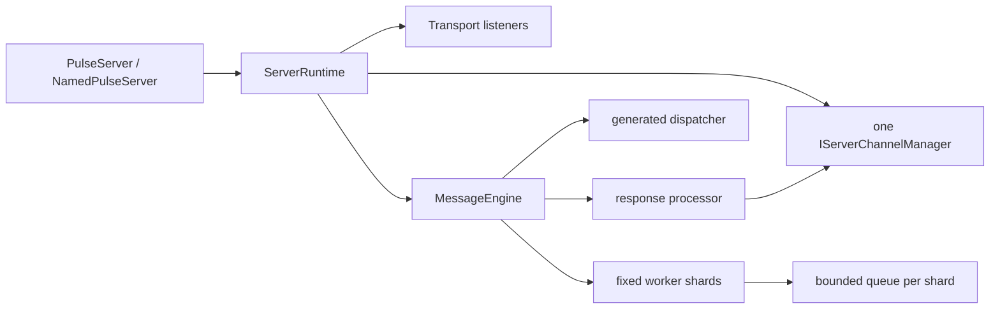

# 服务端运行时

PulseRPC 服务端只有一个当前运行时模型：每个服务端实例由一个内部 `ServerRuntime` 组合根拥有启停状态、监听器和消息管线，并且只引用一个权威 Channel Registry。新项目使用 Generic Host + `AddPulseServer`。



## 推荐注册

```csharp
builder.Services.AddPulseServer(options =>
{
    options.AddTcp("main", 5055);
    options.MessageWorkerShardCount = Math.Max(1, Environment.ProcessorCount);
    options.MessageQueueCapacityPerShard = 1024;
});
```

`PulseServerOptions` 是服务端唯一有效的根配置。当前真正接入运行时的内容包括：

- TCP/KCP transport 配置；
- `MessageWorkerShardCount`；
- `MessageQueueCapacityPerShard`；
- `EnableClientFacingGate`。

旧的 `ServerPreset`、`ServerOptions`、三套 tiered/adaptive options 以及未接线的 timeout/backpressure 字段只为二进制兼容保留，均已标记 `[Obsolete]`。

## 固定 worker shard

`MessageEngine` 在构造时一次性创建固定数量的 worker shard。每个 shard 有一个单消费者有界队列：

1. 连接注册时以 round-robin 选择 shard；
2. 同一 connection generation 在整个生命周期内保持绑定；
3. 队列满时立即拒绝新消息，调用方不会隐式等待或重试；
4. 断连会取消该 generation 的在途请求；
5. 同 ID 重连使用新 lease，旧积压不会进入新连接；
6. 停机等待所有 lease、worker、dispatcher 和 response processor 完成释放。

worker 数不会随连接数增长。当前核心路径不创建每连接处理器，不运行 adaptive scheduler，也不构造 L1/L2/L3 或 `TieredMemoryPool`。

## 单一 Channel Registry

每个 `ServerRuntime` 恰好引用一个 `IServerChannelManager`。消息引擎、响应处理器、服务端查询和广播都使用该实例。

`IPulseServer.ChannelPool` 是这个 registry 的只读兼容视图，不再维护第二个字典；其 mutation 方法会明确抛出 `NotSupportedException`，连接所有权始终留在 runtime。正常网络连接在以下入口中的观察结果一致：

- `IPulseServer.GetChannel`；
- `IPulseServer.GetAllChannels`；
- `IPulseServer.ChannelPool`；
- `IServerChannelManager`。

不同 named server 拥有不同 runtime 和不同 registry；“单一”指每个 runtime 一个权威 registry，不是让多个 named server 共享全局连接表。

## standard、named 与 factory

三种入口都委托同一个内部 `ServerRuntime`：

- standard：`AddPulseServer` 注册一个默认 runtime，并由 HostedService 自动启停；
- named：每个 name 注册一个 keyed runtime，内部依赖和 registry 按 name 隔离，并由统一 catalog HostedService 自动启停；
- factory：`PulseServerFactory` 是兼容入口，内部直接复用 standard DI 组合并拥有该容器，释放 facade 时会释放完整对象图。

新代码不要使用静态 factory。Generic Host 提供更清楚的配置、日志、启动顺序和资源所有权。

在 DI 路径中，`ServerRuntime` 协调停止顺序，容器负责最终 Dispose engine、response processor 与 registry。公开 `PulseServer` 构造函数接收的依赖视为 borrowed，直接构造时仍由调用方释放；兼容 factory 则通过其 owned provider 释放完整对象图。

## 有状态 Service 生命周期

Hub 保持无状态，由标准 DI 管理；有状态 keyed 实例统一由 `PulseServiceManager` 管理，并通过 `IServiceAccessor<TService>` 访问：

```csharp
builder.Services.AddPulseService<RoomService>((services, roomId) =>
    new RoomService(
        roomId,
        services.GetRequiredService<ILogger<RoomService>>()));

builder.Services.AddSingleton<IRoomHub, RoomHub>();

public sealed class RoomHub(IServiceAccessor<RoomService> rooms) : IRoomHub
{
    public async Task SendAsync(string roomId, string text)
    {
        var room = await rooms.GetAsync(roomId);
        await room.EnqueueAsync(() => room.SendAsync(text));
    }
}
```

服务注册目录在 `PulseServiceManager` 首次解析时完成，不依赖 Host 已经执行 `StartAsync`。HostedService 只负责 AutoStart 服务；实例清理器只在最终 options 启用时启动后台循环。

`AddPulseServiceFactory`、`AddPulseHubFactory`、`IPulseHubFactory` 和 `PulseServiceFactoryOptions` 已进入兼容废弃期，不再是推荐生命周期模型。

## 验证入口

相关回归测试：

- `MessageEngineLifecycleTests`；
- `MessageWorkerShardLifecycleTests`；
- `ServerRuntimeCompositionTests`；
- `ServerChannelManagerConcurrencyTests`；
- `PulseServiceRegistrationTests`；
- `PulseServiceManagerLifecycleTests`。

旧的 2025 架构分析已移至[历史设计记录](../archive/historical-design-notes/server-runtime-2025.md)，其中的历史基类与并行 Factory 不代表当前 API。
