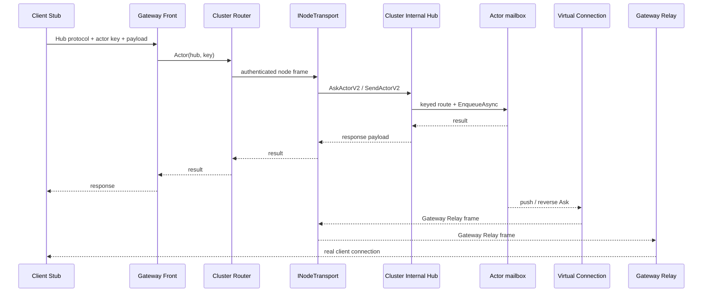

# 经 Gateway 调用 Actor

本指南说明如何让客户端通过 Gateway 按业务键调用 Actor。当前实现对业务契约保持透明：Hub 接口、方法协议号和 DTO 不变，客户端只在获取代理时增加 Actor key。

```csharp
var player = gatewayChannel.GetGatewayActor<IPlayerHub>("player-42");
await player.AddGoldAsync(10);
var gold = await player.GetGoldAsync();
```

这里的“透明”是调用语义透明，不代表零开销。客户端会把普通 Stub 的请求封装为 Gateway Front 请求，跨节点调用还会增加一层 MemoryPack envelope 和当前实现中的 `byte[]` 复制。

## 1. 定义共享契约

把 Hub 接口放在客户端与服务端共同引用的契约项目中：

```csharp
using PulseRPC;

[Channel("GameServer")]
[ClientFacing]
public interface IPlayerHub : IPulseHub
{
    Task AddGoldAsync(long amount);

    [Reentrant]
    Task<long> GetGoldAsync();
}
```

在客户端项目中声明要生成的代理：

```csharp
using PulseRPC;

[PulseClientGeneration(typeof(IPlayerHub))]
public partial class ClientContracts
{
}
```

`[PulseClientGeneration]` 让客户端 Source Generator 生成 `IPlayerHub` Stub 和 `GetGatewayActor<T>` 扩展。`[ClientFacing]` 是协议可见性白名单，不等同于用户认证或授权。生成路由会在参数反序列化和 Actor 激活前强制执行 `[Authorize]`、角色、权限、policy、`[Internal]` / `[ExternalOnly]`；资源归属等依赖业务数据的规则仍应在领域授权服务中校验。

只把真正只读的方法标记为 `[Reentrant]`。同一 Actor 的可重入读可以彼此并发，但不会与普通写方法重叠；错误地在可重入方法中修改状态会破坏 Actor 的串行状态假设。

## 2. 实现有状态 Actor

Actor 实现需要同时继承 `PulseServiceBase` 并实现 Hub 接口。以下示例把状态持久化交给业务仓储：

```csharp
using Microsoft.Extensions.Logging;
using PulseRPC.Server.Services;

[PulseService(
    DisplayName = "PlayerHub",
    Scenario = ServiceScenario.Actor,
    InstanceScope = ServiceInstanceScope.MultiInstance)]
public sealed class PlayerActor : PulseServiceBase, IPlayerHub
{
    private readonly IPlayerRepository _repository;
    private long _gold;

    public PlayerActor(
        string playerId,
        IPlayerRepository repository,
        ILogger<PlayerActor> logger)
        : base(
            "PlayerHub",
            playerId,
            logger,
            ServiceExecutionOptions.Actor)
    {
        _repository = repository;
    }

    public Task AddGoldAsync(long amount)
    {
        _gold += amount;
        return Task.CompletedTask;
    }

    public Task<long> GetGoldAsync() => Task.FromResult(_gold);

    public override async Task OnStartingAsync(
        CancellationToken cancellationToken = default)
    {
        _gold = await _repository.LoadGoldAsync(ServiceId, cancellationToken);
    }

    public override Task OnStoppingAsync(
        CancellationToken cancellationToken = default)
        => _repository.SaveGoldAsync(ServiceId, _gold, cancellationToken);
}
```

示例只展示生命周期接入方式。金币、库存等关键状态不能只等停止时保存；业务方法应在成功响应前完成幂等持久化或可靠日志提交。

`DisplayName` 必须等于 Hub 接口去掉前导 `I` 后的短名。本例的 `IPlayerHub` 对应 `PlayerHub`；keyed 路由会用这个名称向 `PulseServiceManager` 解析实例。构造函数传给基类的 `serviceType` 也应使用同一个稳定名称。

当前 keyed Source Generator 路由在解析到 `PulseServiceBase` 后，会把业务调用提交到该实例的 mailbox。普通方法作为独占写执行，`[Reentrant]` 方法作为可重入读执行；调用异常会返回给调用方。正常停止 Actor 时，运行时停止接收新工作，并最多等待 30 秒处理已接收的 mailbox 工作，再调用 `OnStoppingAsync`；超时后会取消处理循环，因此不能把停止钩子当作无条件排空保证。

这不意味着任意调用都会自动入队。直接从 DI 或 `IServiceAccessor<T>.GetAsync` 取得 Actor 后调用其方法会绕过 mailbox；进程内业务代码应通过生成的路由、`IServiceAccessor<T>.ExecuteAsync` / `ExecuteReadAsync`，或显式 `EnqueueAsync` 访问状态。

## 3. 注册 Actor

在承载 Actor 的后端节点注册业务仓储和按 key 创建实例的工厂：

```csharp
services.AddSingleton<IPlayerRepository, PlayerRepository>();

services.AddPulseService<PlayerActor>((serviceProvider, playerId) =>
    new PlayerActor(
        playerId,
        serviceProvider.GetRequiredService<IPlayerRepository>(),
        serviceProvider.GetRequiredService<ILogger<PlayerActor>>()));
```

`AddPulseService<T>` 会注册 `PulseServiceManager`、实例工厂和 `IServiceAccessor<T>`。同一个 `playerId` 在该管理器中解析到同一 Actor 实例，直到实例被回收或停止。

## 4. 装配 Gateway 与集群

所有节点先注册 `AddPulseServer(...)`，再注册 `AddPulseClustering(...)`。只有接受外部客户端连接的节点调用 `AddPulseGateway()`；承载 Actor 的后端节点注册 `AddPulseService<PlayerActor>()`。

`AddPulseClustering` 默认注册内置 `TcpNodeTransport`。生产还必须注册共享租约和显式声明外部 mTLS 保护：

```csharp
using PulseRPC.Clustering;
using PulseRPC.Backplane.Redis;
using PulseRPC.Server.Configuration;
using PulseRPC.Server.Extensions;
using StackExchange.Redis;

services.AddSingleton<IConnectionMultiplexer>(
    ConnectionMultiplexer.Connect(configuration.GetConnectionString("Redis")!));

services.AddPulseServer(options =>
{
    options.UsePreset(ServerPreset.Default).AddTcp(7000);
    options.EnableClientFacingGate = true;
});
services.AddPulseClustering(
    topology =>
    {
        topology.LocalNodeId = "gateway-1";
        topology.Members.Add(new ClusterNodeEndpoint
        {
            NodeId = "gateway-1",
            Host = "10.0.0.10",
            Port = 7000
        });
        topology.Members.Add(new ClusterNodeEndpoint
        {
            NodeId = "game-1",
            Host = "10.0.0.20",
            Port = 7000
        });
    },
    auth => auth.SharedSecret = configuration["Cluster:SharedSecret"]!);

services.AddRedisActorLeases(options =>
    options.KeyPrefix = "pulserpc:production:game-cluster");
services.Configure<TcpNodeTransportOptions>(options =>
    options.SecurityMode = NodeTransportSecurityMode.ExternalMutualTls);

services.AddPulseGateway(); // 仅 Gateway 角色需要
```

`ExternalMutualTls` 是运维断言：节点端口必须真的位于双向 TLS 的 mesh、sidecar 或 TLS 终止层之后。内置 TCP 不自行加密；未设置 `SecurityMode` 会 fail closed，`InsecureDevelopment` 仅接受 loopback。

新部署建议显式开启 `EnableClientFacingGate`；`IGatewayFrontHub` 与允许外部访问的业务契约必须标记 `[ClientFacing]`。这仍只是协议可见性控制，不能替代资源级业务授权。

## 5. 创建强类型客户端代理

客户端先建立到 Gateway 的普通 `IClientChannel`，再用 Actor key 获取代理：

```csharp
using PulseRPC.Client;

IClientChannel gatewayChannel = channel;

var player = gatewayChannel.GetGatewayActor<IPlayerHub>("player-42");
await player.AddGoldAsync(10);
var currentGold = await player.GetGoldAsync();
```

`GetGatewayActor<T>` 是 Source Generator 生成的便捷入口，等价于先调用 `ForGatewayActor<T>(key)` 创建不拥有底层连接的通道视图，再复用普通 `GetHub<T>()` Stub。释放该视图不会断开 `gatewayChannel`。

## 调用链

远程 Actor 的 Ask/Send 路径如下；Actor 对客户端的推送或反向 Ask 走下半段的反向链路：



具体职责边界是：

- `GatewayActorChannel` 只负责把普通业务 Stub 包装为 Gateway Front 协议。
- `GatewayFrontHub` 用 `(hub, key)` 调用 `IPulseRouter`，并登记真实客户端所在的 Gateway 节点。
- 远程 owner 通过 `TransportBackedNodeLink` 和内置 `TcpNodeTransport` 进入 `IClusterInternalHub`；连接先完成双向节点凭据校验和 wire 能力协商。
- 生成的 keyed 路由解析 Actor 实例；当实现是 `PulseServiceBase` 时，调用进入 mailbox。
- 后端把来源连接表示为 `GatewayVirtualChannel`。推送和反向 Ask 经 `IGatewayRelayHub` 回到持有真实连接的 Gateway。

## 状态与一致性实践

- `OnStartingAsync` 负责从业务仓储恢复状态；在它成功前 Actor 不应对外服务。
- `OnStoppingAsync` 适合保存正常停止且 mailbox 在等待窗口内排空后的最终快照，但超时取消或进程崩溃时不保证完整执行。关键写操作应在业务方法中同步持久化，或采用日志、事件流、事务/outbox、周期检查点等策略。
- 仓储写入使用版本号或 compare-and-set，扣费、发奖、库存等命令携带幂等键。路由投递语义不能替代业务 exactly-once。
- `IActorStateSnapshot` 面向显式迁移内存态，不是通用持久化数据库，也不会自动保存所有 Actor。
- Actor key 只用于寻址，不能作为已认证用户身份或授权证据。

## 生产运行边界

当前闭环包括内置 TCP 节点数据面、wire v2 能力协商、完整 caller claims、lease fencing、Redis CAS + TTL、严格 `(Hub, ProtocolId)` 路由和授权强制链。部署时仍需明确以下边界：

1. `TcpNodeTransport` 不自行提供 TLS。生产必须实际部署外部 mTLS，并设置 `SecurityMode=ExternalMutualTls`；应用层时间窗凭据不能替代线路机密性、完整性和防中间人保护。
2. 默认 `InMemoryActorLeaseStore` 只服务单进程；多成员拓扑默认拒绝它。生产调用 `AddRedisActorLeases`，或注册具备等价 CAS + TTL 语义的 Etcd/数据库实现。
3. wire v2 传播完整 `ClaimsPrincipal`、权限、角色与过期时间，不传播 bearer token；缺少 claims 能力时外部用户调用 fail closed。受信节点可以代表其入口认证结果，因此节点信任域必须严格受控。
4. 框架没有通用 durable Actor state store。状态恢复、并发版本、幂等、崩溃恢复和数据迁移仍由业务仓储负责；lease fencing 只保护执行准入，关键状态写应在持久化层校验版本/fencing token。
5. `ThreeNodeTcpTopology` 让外部用户进入 A 的真实 `GatewayFrontHub`，再经真实 loopback TCP 到 B、C；C 校验 claims，故障测试覆盖停机、无重复、隔离与 TTL 恢复，`cluster-three-hop` 基准复用同一拓扑。它仍是同进程 loopback 回归，不能替代目标网络、Redis、mTLS 和真实 payload 下的容量测试。
6. 所有网络、Gateway 和 keyed 路由入口都在 placement/反序列化/激活前校验 canonical `(Hub, ProtocolId)`；协议冲突与 canonical Hub 重名保持为构建错误。
7. 注解强制链覆盖 `[Authorize]`、`[AllowAnonymous]`、角色、权限、scope、policy、`[Internal]` 与 `[ExternalOnly]`。租户/资源归属等动态规则仍需业务授权。

上线前应在目标环境复跑共享 Redis、mTLS、断线、owner 切换、长处理与重复投递演练，并用相同拓扑和 payload 留存基准数据。

## 相关文档

- [Actor 服务开发](actor-services.md)
- [Actor 模型](../concepts/actor-model.md)
- [集群与路由](../concepts/clustering-and-routing.md)
- [认证与授权](authentication.md)
- [性能指南](performance.md)
