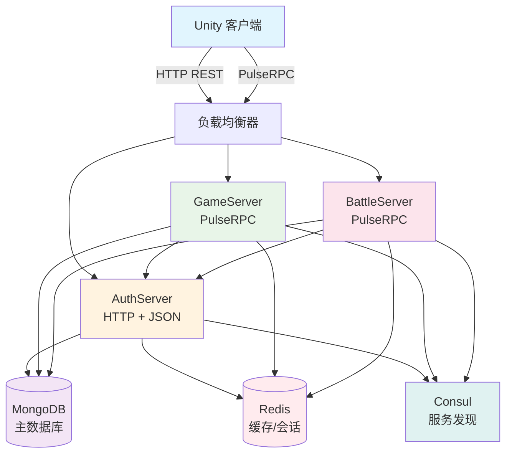

# GameApp 系统架构设计

## 总体架构

GameApp 采用分布式微服务架构，将系统拆分为多个独立的服务模块，每个服务专注于特定的业务领域。



## 服务架构详解

### 1. AuthServer (认证服务器)

**技术栈**: ASP.NET Core + HTTP REST API + JSON

**职责**:
- 用户注册、登录验证
- JWT Token 生成和验证
- GameTicket 生成和验证
- 用户权限管理
- 区服信息管理

**核心组件**:
```
AuthServer/
├── Controllers/
│   ├── AuthController.cs        # 认证相关 API
│   ├── UserController.cs        # 用户管理 API
│   └── ZoneController.cs        # 区服管理 API
├── Services/
│   ├── AuthService.cs           # 认证业务逻辑
│   ├── TokenService.cs          # Token 管理
│   ├── UserService.cs           # 用户业务逻辑
│   └── ZoneService.cs           # 区服业务逻辑
├── Models/
│   ├── LoginRequest.cs          # 登录请求模型
│   ├── AuthResponse.cs          # 认证响应模型
│   └── GameTicket.cs            # 游戏票据模型
├── Infrastructure/
│   ├── MongoDbContext.cs        # MongoDB 上下文
│   ├── RedisService.cs          # Redis 服务
│   └── ConsulService.cs         # Consul 服务
└── Middleware/
    ├── AuthenticationMiddleware.cs # 认证中间件
    └── ExceptionMiddleware.cs      # 异常处理中间件
```

**数据流**:
1. 客户端发送 HTTP POST 请求到 `/api/auth/login`
2. AuthServer 验证用户凭据
3. 生成 JWT Token 和 GameTicket
4. 返回认证信息给客户端

### 2. GameServer (游戏逻辑服务器)

**技术栈**: PulseRPC + TCP/KCP 传输

**职责**:
- 游戏世界状态管理
- 角色数据管理
- 玩家交互处理
- 游戏逻辑计算
- 实时消息推送

**核心组件**:
```
GameServer/
├── Services/
│   ├── IPlayerService.cs        # 玩家服务接口
│   ├── IWorldService.cs         # 世界服务接口
│   ├── IInventoryService.cs     # 背包服务接口
│   └── IChatService.cs          # 聊天服务接口
├── Implementations/
│   ├── PlayerService.cs         # 玩家服务实现
│   ├── WorldService.cs          # 世界服务实现
│   ├── InventoryService.cs      # 背包服务实现
│   └── ChatService.cs           # 聊天服务实现
├── Models/
│   ├── Player.cs                # 玩家模型
│   ├── World.cs                 # 世界模型
│   ├── GameSession.cs           # 游戏会话
│   └── Position.cs              # 位置信息
├── Managers/
│   ├── PlayerManager.cs         # 玩家管理器
│   ├── WorldManager.cs          # 世界管理器
│   └── SessionManager.cs        # 会话管理器
└── Infrastructure/
    ├── GameDbContext.cs         # 游戏数据上下文
    ├── CacheService.cs          # 缓存服务
    └── MessageBus.cs            # 消息总线
```

**数据流**:
1. 客户端通过 PulseRPC 连接到 GameServer
2. 使用 GameTicket 进行身份验证
3. 建立游戏会话，加载角色数据
4. 处理游戏业务逻辑请求
5. 实时推送游戏状态更新

### 3. BattleServer (战斗服务器)

**技术栈**: PulseRPC + KCP 传输（低延迟）

**职责**:
- 实时战斗逻辑处理
- 技能系统管理
- 伤害计算和验证
- 战斗状态同步
- 战斗结果统计

**核心组件**:
```
BattleServer/
├── Services/
│   ├── IBattleService.cs        # 战斗服务接口
│   ├── ISkillService.cs         # 技能服务接口
│   └── ICombatService.cs        # 战斗计算服务
├── Implementations/
│   ├── BattleService.cs         # 战斗服务实现
│   ├── SkillService.cs          # 技能服务实现
│   └── CombatService.cs         # 战斗计算实现
├── Models/
│   ├── Battle.cs                # 战斗模型
│   ├── Skill.cs                 # 技能模型
│   ├── Combatant.cs             # 战斗者模型
│   └── BattleResult.cs          # 战斗结果
├── Engines/
│   ├── BattleEngine.cs          # 战斗引擎
│   ├── SkillEngine.cs           # 技能引擎
│   └── DamageEngine.cs          # 伤害计算引擎
└── Synchronization/
    ├── BattleStateSyncer.cs     # 战斗状态同步
    └── RealtimeUpdater.cs       # 实时更新器
```

**数据流**:
1. 玩家请求加入战斗
2. BattleServer 创建战斗实例
3. 实时处理战斗指令
4. 计算战斗结果
5. 同步战斗状态到所有参与者

### 4. Unity 客户端架构

**核心组件**:
```
GameApp.Unity/
├── Scripts/
│   ├── Network/
│   │   ├── AuthClient.cs        # 认证客户端
│   │   ├── GameClient.cs        # 游戏客户端
│   │   ├── BattleClient.cs      # 战斗客户端
│   │   └── NetworkManager.cs    # 网络管理器
│   ├── UI/
│   │   ├── LoginUI.cs           # 登录界面
│   │   ├── GameUI.cs            # 游戏界面
│   │   ├── BattleUI.cs          # 战斗界面
│   │   └── MessageUI.cs         # 消息界面
│   ├── Game/
│   │   ├── Player.cs            # 玩家逻辑
│   │   ├── World.cs             # 世界逻辑
│   │   └── Battle.cs            # 战斗逻辑
│   ├── Managers/
│   │   ├── GameManager.cs       # 游戏管理器
│   │   ├── UIManager.cs         # UI 管理器
│   │   └── AudioManager.cs      # 音频管理器
│   └── Utils/
│       ├── JsonHelper.cs        # JSON 工具
│       └── ConfigHelper.cs      # 配置工具
├── Scenes/
│   ├── LoginScene.unity         # 登录场景
│   ├── GameScene.unity          # 游戏场景
│   └── BattleScene.unity        # 战斗场景
└── Prefabs/
    ├── UI/                      # UI 预制件
    ├── Characters/              # 角色预制件
    └── Effects/                 # 特效预制件
```

## 通信协议设计

### 1. HTTP REST API (AuthServer)

**认证接口**:
```
POST /api/auth/login        # 用户登录
POST /api/auth/register     # 用户注册
POST /api/auth/logout       # 用户登出
POST /api/auth/refresh      # 刷新 Token
GET  /api/auth/verify       # 验证 Token
```

**区服接口**:
```
GET  /api/zone/list         # 获取区服列表
GET  /api/zone/{id}         # 获取区服详情
POST /api/zone/select       # 选择区服
```

### 2. PulseRPC 协议 (GameServer)

**玩家服务**:
```csharp
[Channel("TcpChannel")]
public interface IPlayerService : IPulseService
{
    ValueTask<LoginResponse> LoginAsync(LoginRequest request);
    ValueTask<PlayerInfo> GetPlayerInfoAsync(GetPlayerInfoRequest request);
    [Channel("KcpChannel")]
    ValueTask UpdatePositionAsync(UpdatePositionRequest request);
    ValueTask LogoutAsync(LogoutRequest request);
}
```

**世界服务与事件**:
```csharp
[Channel("TcpChannel")]
public interface IWorldService : IPulseService
{
    ValueTask<WorldState> GetWorldStateAsync(GetWorldStateRequest request);
    ValueTask JoinWorldAsync(JoinWorldRequest request);
    ValueTask LeaveWorldAsync(LeaveWorldRequest request);
}

[Channel("TcpChannel")]
public interface IWorldEvents : IPulseEventHandler
{
    void OnWorldUpdate(WorldUpdateEvent eventData);
    void OnPlayerJoined(PlayerJoinedEvent eventData);
    void OnPlayerLeft(PlayerLeftEvent eventData);
}
```

### 3. PulseRPC 协议 (BattleServer)

**战斗服务与事件**:
```csharp
[Channel("KcpChannel")]
public interface IBattleService : IPulseService
{
    ValueTask<BattleInfo> JoinBattleAsync(JoinBattleRequest request);
    ValueTask LeaveBattleAsync(LeaveBattleRequest request);
    ValueTask<SkillResult> UseSkillAsync(UseSkillRequest request);
}

[Channel("KcpChannel")]
public interface IBattleEvents : IPulseEventHandler
{
    void OnBattleStateUpdate(BattleStateUpdateEvent eventData);
    void OnSkillUsed(SkillUsedEvent eventData);
    void OnDamageDealt(DamageDealtEvent eventData);
    void OnPlayerDefeated(PlayerDefeatedEvent eventData);
}
```

## 数据存储架构

### MongoDB 数据组织

**数据库结构**:
```
gameapp_db/
├── users                   # 用户信息集合
├── players                 # 玩家角色集合
├── worlds                  # 游戏世界集合
├── battles                 # 战斗记录集合
├── items                   # 道具信息集合
├── guilds                  # 公会信息集合
└── logs                    # 系统日志集合
```

### Redis 缓存设计

**缓存键命名规范**:
```
# 用户会话
session:{userId}            # 用户会话信息
auth_token:{token}          # 认证令牌信息
game_ticket:{ticket}        # 游戏票据信息

# 玩家数据
player:{playerId}           # 玩家基础信息
player_pos:{playerId}       # 玩家位置信息
player_stats:{playerId}     # 玩家统计信息

# 世界状态
world:{worldId}             # 世界状态
world_players:{worldId}     # 世界在线玩家

# 战斗数据
battle:{battleId}           # 战斗状态
battle_participants:{battleId} # 战斗参与者

# 配置数据
config:zones                # 区服配置
config:items                # 道具配置
```

## 服务发现与配置

### Consul 配置结构

**服务注册**:
```json
{
  "service": {
    "name": "gameapp-authserver",
    "id": "gameapp-authserver-1",
    "port": 8080,
    "address": "192.168.1.100",
    "tags": ["auth", "http", "v1.0"],
    "check": {
      "http": "http://192.168.1.100:8080/health",
      "interval": "10s"
    }
  }
}
```

**KV 存储配置**:
```
gameapp/
├── config/
│   ├── database/mongodb_connection
│   ├── database/redis_connection
│   ├── auth/jwt_secret
│   ├── auth/token_expire
│   └── game/world_config
├── services/
│   ├── authserver/
│   ├── gameserver/
│   └── battleserver/
└── zones/
    ├── zone1/config
    ├── zone2/config
    └── zone3/config
```

## 安全架构

### 1. 认证安全
- JWT Token 基于 RSA256 签名
- GameTicket 具有时效性和一次性使用限制
- 密码使用 BCrypt 加盐哈希存储
- 支持多重认证（MFA）

### 2. 通信安全
- HTTP API 强制使用 HTTPS
- PulseRPC 连接支持 TLS 加密
- 所有敏感数据传输加密
- API 访问频率限制

### 3. 数据安全
- MongoDB 启用认证和授权
- Redis 配置访问密码
- 数据库连接字符串加密存储
- 敏感配置使用 Consul KV 加密

## 监控与日志

### 1. 应用监控
- 健康检查端点
- 性能指标收集
- 错误率监控
- 服务可用性监控

### 2. 日志系统
- 结构化日志记录
- 日志级别分层
- 日志集中收集
- 敏感信息脱敏

### 3. 告警机制
- 服务宕机告警
- 性能异常告警
- 错误率超阈值告警
- 资源使用率告警

## 扩展性设计

### 1. 水平扩展
- 无状态服务设计
- 负载均衡支持
- 数据库分片
- 缓存集群

### 2. 容错处理
- 服务降级
- 熔断机制
- 重试策略
- 优雅降级

### 3. 性能优化
- 连接池复用
- 缓存策略
- 异步非阻塞 I/O
- 数据库索引优化

---

本架构设计确保了系统的高可用性、可扩展性和安全性，为游戏业务的快速发展提供了坚实的技术基础。
