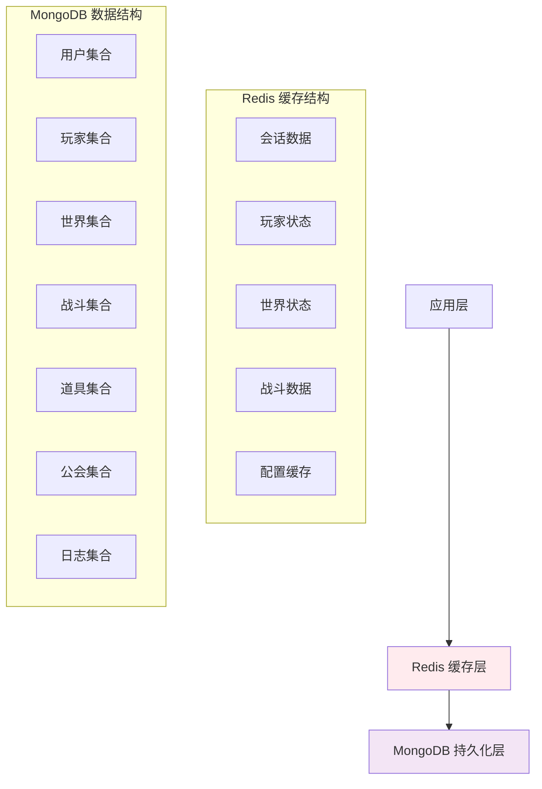

# GameApp 数据库设计

## 数据库架构概述

GameApp 使用混合存储架构，结合 MongoDB 的文档存储优势和 Redis 的高性能缓存能力，为游戏系统提供完整的数据存储解决方案。



## MongoDB 数据库设计

### 数据库命名规范

- **数据库名称**: `gameapp_db`
- **集合命名**: 使用复数形式小写单词，如 `users`, `players`
- **字段命名**: 使用 camelCase 格式，如 `firstName`, `lastLoginTime`
- **索引命名**: 使用字段名组合，如 `idx_username`, `idx_playerId_worldId`

### 1. 用户集合 (users)

**用途**: 存储用户账号信息和认证数据

```javascript
{
  _id: ObjectId("..."),                    // MongoDB 自动生成的 ID
  userId: 12345,                           // 用户唯一 ID（业务主键）
  username: "player001",                   // 用户名（唯一）
  email: "player001@example.com",          // 邮箱（唯一）
  passwordHash: "$2b$10$...",              // 密码哈希值
  salt: "randomSalt123",                   // 密码盐值
  status: "active",                        // 账号状态：active, banned, inactive
  registrationTime: ISODate("2024-01-01T00:00:00Z"), // 注册时间
  lastLoginTime: ISODate("2024-01-15T10:30:00Z"),    // 最后登录时间
  loginCount: 100,                         // 登录次数
  profile: {                               // 用户资料
    nickname: "玩家001",                   // 昵称
    avatar: "avatar_001.jpg",              // 头像文件名
    level: 25,                             // 账号等级
    vipLevel: 2,                           // VIP 等级
    gender: "male",                        // 性别
    birthday: ISODate("1990-05-15T00:00:00Z"), // 生日
    region: "CN",                          // 地区代码
    language: "zh-CN"                      // 语言偏好
  },
  security: {                              // 安全设置
    twoFactorEnabled: false,               // 双重认证
    securityQuestions: [                   // 安全问题
      {
        question: "What's your first pet's name?",
        answerHash: "$2b$10$..."
      }
    ],
    loginHistory: [                        // 登录历史（最近10次）
      {
        ip: "192.168.1.100",
        userAgent: "Unity/2022.3",
        loginTime: ISODate("2024-01-15T10:30:00Z"),
        success: true
      }
    ]
  },
  preferences: {                           // 用户偏好设置
    language: "zh-CN",                     // 语言设置
    soundEnabled: true,                    // 声音开关
    musicEnabled: true,                    // 音乐开关
    notificationEnabled: true              // 通知开关
  },
  gameData: {                              // 游戏相关数据
    totalPlayTime: 360000,                 // 总游戏时长（秒）
    achievementPoints: 1500,               // 成就点数
    lastSelectedZone: "zone001"            // 最后选择的区服
  },
  createdAt: ISODate("2024-01-01T00:00:00Z"), // 创建时间
  updatedAt: ISODate("2024-01-15T10:30:00Z")   // 更新时间
}
```

**索引设计**:
```javascript
// 唯一索引
db.users.createIndex({ "userId": 1 }, { unique: true })
db.users.createIndex({ "username": 1 }, { unique: true })
db.users.createIndex({ "email": 1 }, { unique: true })

// 查询索引
db.users.createIndex({ "status": 1 })
db.users.createIndex({ "lastLoginTime": -1 })
db.users.createIndex({ "profile.level": -1 })
```

### 2. 玩家集合 (players)

**用途**: 存储游戏角色数据和游戏状态

```javascript
{
  _id: ObjectId("..."),
  playerId: 67890,                         // 玩家唯一 ID
  userId: 12345,                           // 关联用户 ID
  zoneId: "zone001",                       // 所属区服 ID
  characterName: "勇敢的战士",             // 角色名称
  class: "warrior",                        // 职业：warrior, mage, archer, priest
  level: 45,                               // 等级
  experience: 125000,                      // 经验值
  experienceToNext: 15000,                 // 升级所需经验

  attributes: {                            // 基础属性
    strength: 120,                         // 力量
    agility: 85,                          // 敏捷
    intelligence: 60,                      // 智力
    constitution: 100,                     // 体质
    luck: 75                              // 幸运
  },

  status: {                               // 当前状态
    health: 1200,                         // 当前生命值
    maxHealth: 1500,                      // 最大生命值
    mana: 300,                            // 当前魔法值
    maxMana: 500,                         // 最大魔法值
    stamina: 800,                         // 当前体力值
    maxStamina: 1000                      // 最大体力值
  },

  position: {                             // 位置信息
    worldId: "world001",                  // 世界 ID
    mapId: "map_001",                     // 地图 ID
    x: 1250.5,                            // X 坐标
    y: 0.0,                               // Y 坐标
    z: 890.3,                             // Z 坐标
    rotation: 45.0                        // 旋转角度
  },

  inventory: {                            // 背包系统
    capacity: 100,                        // 背包容量
    items: [                              // 道具列表
      {
        itemId: "sword_001",              // 道具 ID
        quantity: 1,                      // 数量
        slot: 0,                          // 槽位
        enchantLevel: 5,                  // 强化等级
        durability: 85,                   // 耐久度
        attributes: {                     // 道具属性
          attack: 150,
          criticalRate: 0.15
        }
      }
    ],
    gold: 25000                           // 金币数量
  },

  equipment: {                            // 装备系统
    weapon: "sword_001",                  // 武器
    armor: "armor_001",                   // 护甲
    helmet: "helmet_001",                 // 头盔
    boots: "boots_001",                   // 靴子
    accessory1: "ring_001",               // 饰品1
    accessory2: "necklace_001"            // 饰品2
  },

  skills: [                               // 技能系统
    {
      skillId: "skill_001",               // 技能 ID
      level: 10,                          // 技能等级
      experience: 5000,                   // 技能经验
      lastUsed: ISODate("2024-01-15T10:20:00Z") // 最后使用时间
    }
  ],

  quests: {                               // 任务系统
    active: [                             // 进行中的任务
      {
        questId: "quest_001",             // 任务 ID
        progress: {                       // 任务进度
          "killGoblins": 5,               // 已击败哥布林数量
          "collectItems": 3               // 已收集道具数量
        },
        acceptedAt: ISODate("2024-01-15T09:00:00Z")
      }
    ],
    completed: ["quest_000", "quest_002"], // 已完成任务 ID 列表
    daily: {                              // 日常任务
      lastResetDate: ISODate("2024-01-15T00:00:00Z"),
      tasks: [
        {
          taskId: "daily_001",
          completed: true,
          progress: 10
        }
      ]
    }
  },

  social: {                               // 社交系统
    guildId: "guild_001",                 // 公会 ID
    friends: [23456, 34567],              // 好友列表
    blocked: [45678],                     // 黑名单
    reputation: {                         // 声望系统
      honor: 1500,                        // 荣誉点
      faction: "alliance",                // 阵营
      titles: ["勇者", "屠龙者"]          // 称号列表
    }
  },

  statistics: {                           // 统计数据
    playTime: 180000,                     // 游戏时长（秒）
    monstersKilled: 2500,                 // 击败怪物数
    questsCompleted: 150,                 // 完成任务数
    deathCount: 12,                       // 死亡次数
    loginDays: 30,                        // 登录天数
    lastActiveTime: ISODate("2024-01-15T10:30:00Z")
  },

  settings: {                             // 玩家偏好设置
    autoPickup: true,                     // 自动拾取
    showDamageNumbers: true,              // 显示伤害数字
    allowTrade: true,                     // 允许交易
    allowDuel: false                      // 允许决斗
  },

  createdAt: ISODate("2024-01-01T00:00:00Z"),
  updatedAt: ISODate("2024-01-15T10:30:00Z")
}
```

**索引设计**:
```javascript
// 唯一索引
db.players.createIndex({ "playerId": 1 }, { unique: true })
db.players.createIndex({ "userId": 1, "zoneId": 1 }, { unique: true })
db.players.createIndex({ "characterName": 1, "zoneId": 1 }, { unique: true })

// 查询索引
db.players.createIndex({ "level": -1 })
db.players.createIndex({ "position.worldId": 1 })
db.players.createIndex({ "social.guildId": 1 })
db.players.createIndex({ "statistics.lastActiveTime": -1 })
```

### 3. 世界集合 (worlds)

**用途**: 存储游戏世界和地图信息

```javascript
{
  _id: ObjectId("..."),
  worldId: "world001",                    // 世界 ID
  name: "新手村",                        // 世界名称
  description: "适合新手玩家的安全区域",   // 世界描述
  type: "town",                          // 世界类型：town, dungeon, battlefield
  maxPlayers: 1000,                      // 最大玩家数
  currentPlayers: 256,                   // 当前玩家数
  level: {                               // 等级限制
    min: 1,
    max: 10
  },

  maps: [                                // 地图列表
    {
      mapId: "map_001",                  // 地图 ID
      name: "中央广场",                  // 地图名称
      size: {                            // 地图大小
        width: 2000,
        height: 2000
      },
      spawnPoints: [                     // 出生点
        { x: 1000, y: 0, z: 1000 },
        { x: 1200, y: 0, z: 800 }
      ],
      npcs: [                            // NPC 列表
        {
          npcId: "npc_001",
          name: "商人老王",
          position: { x: 1100, y: 0, z: 900 },
          type: "merchant"
        }
      ],
      monsters: [                        // 怪物刷新点
        {
          monsterId: "goblin_001",
          spawnArea: {
            center: { x: 1500, y: 0, z: 1500 },
            radius: 200
          },
          respawnTime: 300,              // 重生时间（秒）
          maxCount: 10                   // 最大数量
        }
      ],
      resources: [                       // 资源点
        {
          resourceId: "iron_ore",
          positions: [
            { x: 800, y: 0, z: 1200 },
            { x: 1800, y: 0, z: 600 }
          ],
          respawnTime: 600
        }
      ]
    }
  ],

  events: {                              // 世界事件
    scheduled: [                         // 定时事件
      {
        eventId: "daily_boss",
        name: "每日BOSS",
        startTime: "20:00",
        duration: 3600,                  // 持续时间（秒）
        rewards: ["exp_boost", "rare_items"]
      }
    ],
    active: []                           // 当前激活事件
  },

  weather: {                             // 天气系统
    current: "sunny",                    // 当前天气
    temperature: 25,                     // 温度
    humidity: 60,                        // 湿度
    nextChange: ISODate("2024-01-15T14:00:00Z")
  },

  economy: {                             // 经济系统
    taxRate: 0.05,                       // 交易税率
    inflationRate: 0.02,                 // 通胀率
    globalGoldPool: 1000000              // 全服金币池
  },

  rules: {                               // 世界规则
    pvpEnabled: false,                   // PVP 开关
    tradingEnabled: true,                // 交易开关
    guildWarEnabled: false,              // 公会战开关
    dropOnDeath: false                   // 死亡掉落
  },

  status: "active",                      // 世界状态：active, maintenance, closed
  createdAt: ISODate("2024-01-01T00:00:00Z"),
  updatedAt: ISODate("2024-01-15T10:30:00Z")
}
```

### 4. 战斗集合 (battles)

**用途**: 存储战斗记录和战斗实例数据

```javascript
{
  _id: ObjectId("..."),
  battleId: "battle_001",                // 战斗 ID
  type: "pvp",                          // 战斗类型：pve, pvp, guild_war, boss
  status: "completed",                   // 状态：waiting, active, completed
  worldId: "world001",                   // 发生世界
  mapId: "map_001",                      // 发生地图

  participants: [                        // 参与者
    {
      playerId: 67890,
      teamId: "team_1",                  // 队伍 ID
      role: "dps",                       // 角色定位：tank, dps, healer
      joinTime: ISODate("2024-01-15T10:00:00Z"),
      leftTime: null,                    // 离开时间
      status: "active"                   // 参与状态：active, disconnected, dead
    }
  ],

  timeline: [                            // 战斗时间线
    {
      timestamp: ISODate("2024-01-15T10:00:10Z"),
      type: "skill_used",                // 事件类型
      sourcePlayerId: 67890,
      targetPlayerId: 67891,
      skillId: "fireball",
      damage: 250,
      effects: ["burn"],                 // 造成的效果
      position: { x: 1200, y: 0, z: 900 }
    }
  ],

  result: {                              // 战斗结果
    winner: "team_1",                    // 获胜方
    reason: "elimination",               // 胜利原因：elimination, timeout, surrender
    duration: 480,                      // 战斗时长（秒）
    rewards: {                           // 奖励分配
      "67890": {
        experience: 1500,
        gold: 200,
        items: ["potion_001"],
        honor: 50
      }
    },
    statistics: {                        // 统计数据
      totalDamage: 15000,
      skillsUsed: 120,
      playersKilled: 3
    }
  },

  startTime: ISODate("2024-01-15T10:00:00Z"),
  endTime: ISODate("2024-01-15T10:08:00Z"),
  createdAt: ISODate("2024-01-15T10:00:00Z")
}
```

### 5. 道具集合 (items)

**用途**: 存储游戏道具的基础信息和模板

```javascript
{
  _id: ObjectId("..."),
  itemId: "sword_001",                   // 道具 ID
  name: "新手之剑",                      // 道具名称
  description: "适合新手使用的基础武器",  // 道具描述
  type: "weapon",                        // 道具类型：weapon, armor, consumable, material, quest
  subType: "sword",                      // 子类型
  rarity: "common",                      // 稀有度：common, uncommon, rare, epic, legendary
  level: 1,                              // 道具等级

  attributes: {                          // 基础属性
    attack: 50,                          // 攻击力
    defense: 0,                          // 防御力
    durability: 100,                     // 耐久度
    weight: 2.5                          // 重量
  },

  requirements: {                        // 使用要求
    level: 1,                            // 等级要求
    class: ["warrior"],                  // 职业要求
    strength: 10                         // 属性要求
  },

  effects: [                             // 道具效果
    {
      type: "passive",                   // 效果类型：passive, active, on_use
      effectId: "increase_attack",
      value: 50,
      duration: 0                        // 持续时间（0为永久）
    }
  ],

  crafting: {                            // 制作信息
    craftable: true,                     // 是否可制作
    materials: [                         // 所需材料
      { itemId: "iron_ore", quantity: 5 },
      { itemId: "wood", quantity: 2 }
    ],
    skillRequired: "blacksmithing",      // 所需技能
    skillLevel: 1                        // 技能等级要求
  },

  trading: {                             // 交易信息
    tradeable: true,                     // 是否可交易
    vendorPrice: 100,                    // 商店价格
    stackSize: 1                         // 堆叠数量
  },

  dropSources: [                         // 掉落来源
    {
      sourceType: "monster",             // 来源类型：monster, quest, craft, shop
      sourceId: "goblin_001",
      dropRate: 0.1                      // 掉落率
    }
  ],

  icon: "icons/sword_001.png",           // 图标路径
  model: "models/sword_001.fbx",         // 3D模型路径
  createdAt: ISODate("2024-01-01T00:00:00Z"),
  updatedAt: ISODate("2024-01-15T10:30:00Z")
}
```

### 6. 公会集合 (guilds)

**用途**: 存储公会信息和成员管理

```javascript
{
  _id: ObjectId("..."),
  guildId: "guild_001",                  // 公会 ID
  name: "光明骑士团",                    // 公会名称
  tag: "LKT",                           // 公会标签
  description: "正义与光明的守护者",      // 公会描述
  level: 5,                             // 公会等级
  experience: 25000,                    // 公会经验

  leader: {                             // 公会会长
    playerId: 67890,
    appointedAt: ISODate("2024-01-01T00:00:00Z")
  },

  members: [                            // 公会成员
    {
      playerId: 67890,
      rank: "leader",                   // 职位：leader, officer, member
      joinDate: ISODate("2024-01-01T00:00:00Z"),
      contribution: 5000,               // 贡献度
      lastActive: ISODate("2024-01-15T10:30:00Z"),
      permissions: ["invite", "kick", "promote"] // 权限列表
    }
  ],

  treasury: {                           // 公会金库
    gold: 500000,                       // 金币
    items: [                            // 道具
      {
        itemId: "guild_banner",
        quantity: 1,
        donatedBy: 67890,
        donatedAt: ISODate("2024-01-10T00:00:00Z")
      }
    ]
  },

  buildings: {                          // 公会建筑
    hall: {                             // 公会大厅
      level: 3,
      benefits: ["member_limit_150", "storage_slots_200"]
    },
    workshop: {                         // 工坊
      level: 2,
      benefits: ["craft_speed_20%", "material_discount_10%"]
    }
  },

  skills: [                             // 公会技能
    {
      skillId: "guild_blessing",
      level: 5,
      effect: "exp_bonus_10%"
    }
  ],

  events: {                             // 公会活动
    wars: [                             // 公会战记录
      {
        opponentGuildId: "guild_002",
        result: "victory",
        startTime: ISODate("2024-01-14T20:00:00Z"),
        endTime: ISODate("2024-01-14T21:30:00Z")
      }
    ],
    raids: [                            // 团队副本记录
      {
        raidId: "dragon_lair",
        result: "success",
        participants: [67890, 67891],
        completedAt: ISODate("2024-01-13T22:00:00Z")
      }
    ]
  },

  settings: {                           // 公会设置
    recruitmentOpen: true,              // 开放招募
    levelRequirement: 20,               // 等级要求
    applicationMessage: "欢迎加入光明骑士团！", // 申请消息
    taxRate: 0.1                        // 公会税率
  },

  statistics: {                         // 统计数据
    totalMembers: 45,                   // 总成员数
    activeMembers: 32,                  // 活跃成员数
    totalContribution: 125000,          // 总贡献度
    warsWon: 8,                        // 公会战胜场
    warsLost: 2                        // 公会战败场
  },

  createdAt: ISODate("2024-01-01T00:00:00Z"),
  updatedAt: ISODate("2024-01-15T10:30:00Z")
}
```

### 7. 日志集合 (logs)

**用途**: 存储系统操作日志和审计信息

```javascript
{
  _id: ObjectId("..."),
  logId: "log_001",                      // 日志 ID
  type: "player_action",                 // 日志类型：system, player_action, error, security
  level: "info",                         // 日志级别：debug, info, warn, error, fatal

  context: {                             // 上下文信息
    userId: 12345,
    playerId: 67890,
    sessionId: "session_001",
    ip: "192.168.1.100",
    userAgent: "Unity/2022.3"
  },

  action: "item_trade",                  // 具体操作
  details: {                             // 详细信息
    fromPlayerId: 67890,
    toPlayerId: 67891,
    items: [
      {
        itemId: "sword_001",
        quantity: 1,
        price: 1000
      }
    ],
    totalPrice: 1000,
    commission: 50
  },

  result: "success",                     // 操作结果：success, failure, error
  message: "玩家交易成功完成",            // 描述信息
  errorCode: null,                       // 错误代码
  stackTrace: null,                      // 错误堆栈

  performance: {                         // 性能信息
    executionTime: 125,                  // 执行时间（毫秒）
    memoryUsage: 45000,                  // 内存使用（KB）
    dbQueries: 3                         // 数据库查询次数
  },

  metadata: {                            // 元数据
    serverNode: "gameserver-01",         // 服务器节点
    version: "1.0.0",                    // 版本号
    environment: "production"            // 环境
  },

  timestamp: ISODate("2024-01-15T10:30:00Z"),
  createdAt: ISODate("2024-01-15T10:30:00Z")
}
```

## Redis 缓存设计

### 1. 会话管理

```redis
# 用户会话信息（TTL: 24小时）
session:12345 = {
  "userId": 12345,
  "username": "player001",
  "loginTime": "2024-01-15T10:00:00Z",
  "lastActivity": "2024-01-15T10:30:00Z",
  "ip": "192.168.1.100",
  "zoneId": "zone001"
}

# JWT Token 黑名单（TTL: Token过期时间）
token_blacklist:jwt_token_hash = "1"

# 游戏票据验证（TTL: 5分钟）
game_ticket:ticket_hash = {
  "userId": 12345,
  "zoneId": "zone001",
  "createdAt": "2024-01-15T10:00:00Z",
  "used": false
}
```

### 2. 玩家状态缓存

```redis
# 玩家基础信息（TTL: 1小时）
player:67890 = {
  "playerId": 67890,
  "characterName": "勇敢的战士",
  "level": 45,
  "class": "warrior",
  "worldId": "world001",
  "guildId": "guild_001"
}

# 玩家位置信息（TTL: 5分钟）
player_pos:67890 = {
  "worldId": "world001",
  "mapId": "map_001",
  "x": 1250.5,
  "y": 0.0,
  "z": 890.3,
  "rotation": 45.0,
  "lastUpdate": "2024-01-15T10:30:00Z"
}

# 玩家在线状态（TTL: 30秒，心跳续期）
player_online:67890 = {
  "status": "online",
  "worldId": "world001",
  "lastHeartbeat": "2024-01-15T10:30:00Z"
}
```

### 3. 世界状态缓存

```redis
# 世界在线玩家列表（无TTL）
world_players:world001 = [67890, 67891, 67892]

# 世界状态信息（TTL: 10分钟）
world:world001 = {
  "currentPlayers": 256,
  "maxPlayers": 1000,
  "status": "active",
  "events": ["daily_boss"],
  "weather": "sunny"
}

# NPC状态（TTL: 5分钟）
npc:npc_001 = {
  "health": 100,
  "status": "alive",
  "position": {"x": 1100, "y": 0, "z": 900},
  "lastInteraction": "2024-01-15T10:25:00Z"
}
```

### 4. 战斗数据缓存

```redis
# 战斗实例数据（TTL: 2小时）
battle:battle_001 = {
  "status": "active",
  "participants": [67890, 67891],
  "startTime": "2024-01-15T10:00:00Z",
  "currentRound": 3
}

# 战斗参与者列表（TTL: 2小时）
battle_participants:battle_001 = [67890, 67891]

# 玩家战斗状态（TTL: 2小时）
player_battle:67890 = {
  "battleId": "battle_001",
  "teamId": "team_1",
  "health": 80,
  "mana": 60,
  "status": "active"
}
```

### 5. 配置数据缓存

```redis
# 系统配置（TTL: 1天）
config:system = {
  "maintenanceMode": false,
  "newPlayerReward": ["item_001", "gold_1000"],
  "maxLevel": 100,
  "expMultiplier": 1.0
}

# 区服配置（TTL: 1小时）
config:zones = [
  {
    "zoneId": "zone001",
    "name": "华夏一区",
    "status": "online",
    "playerCount": 2500,
    "maxPlayers": 5000
  }
]

# 道具配置（TTL: 4小时）
config:items = {
  "sword_001": {
    "name": "新手之剑",
    "attack": 50,
    "price": 100
  }
}
```

## 数据一致性保证

### 1. 缓存更新策略

- **写回策略**: 关键数据（如玩家经验、金币）使用写回策略
- **写透策略**: 日志数据使用写透策略
- **延迟写**: 位置、状态等频繁更新的数据使用延迟写

### 2. 数据同步机制

```javascript
// 数据更新流程
function updatePlayerData(playerId, updateData) {
  // 1. 更新数据库
  await db.players.updateOne(
    { playerId: playerId },
    { $set: updateData, $currentDate: { updatedAt: true } }
  );

  // 2. 更新缓存
  await redis.hset(`player:${playerId}`, updateData);

  // 3. 发布更新事件
  await redis.publish(`player_update:${playerId}`, JSON.stringify(updateData));
}
```

### 3. 分布式锁

```redis
# 玩家数据操作锁（TTL: 30秒）
lock:player:67890 = "server_node_1"

# 公会操作锁（TTL: 60秒）
lock:guild:guild_001 = "server_node_2"

# 世界状态锁（TTL: 10秒）
lock:world:world001 = "server_node_1"
```

## 性能优化建议

### 1. 索引优化

```javascript
// 复合索引优化
db.players.createIndex(
  { "userId": 1, "level": -1, "statistics.lastActiveTime": -1 }
);

// 部分索引（只索引活跃玩家）
db.players.createIndex(
  { "statistics.lastActiveTime": -1 },
  {
    partialFilterExpression: {
      "statistics.lastActiveTime": {
        $gte: new Date(Date.now() - 30 * 24 * 60 * 60 * 1000)
      }
    }
  }
);
```

### 2. 数据分片策略

```javascript
// 按区服分片
sh.shardCollection("gameapp_db.players", { "zoneId": 1, "playerId": 1 })

// 按时间分片（日志集合）
sh.shardCollection("gameapp_db.logs", { "timestamp": 1 })
```

### 3. 缓存预热

```javascript
// 预热热点数据
function warmupCache() {
  // 预热活跃玩家数据
  const activePlayers = await db.players.find({
    "statistics.lastActiveTime": {
      $gte: new Date(Date.now() - 24 * 60 * 60 * 1000)
    }
  });

  for (const player of activePlayers) {
    await redis.hset(`player:${player.playerId}`, player);
  }

  // 预热系统配置
  const config = await db.configs.findOne({ type: "system" });
  await redis.hset("config:system", config);
}
```

---

该数据库设计确保了游戏系统的数据完整性、性能和可扩展性，为游戏业务提供了稳定可靠的数据存储基础。
