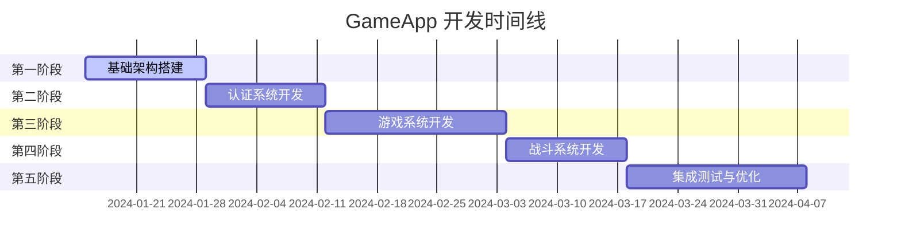

# GameApp 开发任务计划

## 项目开发总览

GameApp 项目预计开发周期为 **12 周**，分为 5 个主要阶段，每个阶段包含详细的开发任务和里程碑。



## 第一阶段：基础架构搭建 (第1-2周)

### 1.1 开发环境准备 (3天)

**目标**: 搭建完整的开发和测试环境

**任务清单**:
- [ ] **Docker 环境配置**
  - [ ] 创建 `docker-compose.yml` 文件
  - [ ] 配置 MongoDB 容器
  - [ ] 配置 Redis 容器
  - [ ] 配置 Consul 容器
  - [ ] 配置网络和数据卷

- [ ] **开发工具配置**
  - [ ] Visual Studio/Rider 项目配置
  - [ ] Unity 项目初始化
  - [ ] Git 仓库和分支策略
  - [ ] CI/CD 流水线基础配置

**交付物**:
```
scripts/
├── docker/
│   ├── docker-compose.yml
│   ├── mongodb/
│   │   └── init-db.js
│   ├── redis/
│   │   └── redis.conf
│   └── consul/
│       └── consul.json
├── deploy/
│   ├── start-dev.sh
│   ├── stop-dev.sh
│   └── reset-env.sh
└── tools/
    ├── generate-certificates.sh
    └── setup-dev-env.sh
```

### 1.2 项目结构初始化 (2天)

**目标**: 创建标准化的项目结构

**任务清单**:
- [ ] **服务端项目结构**
  - [ ] 创建 AuthServer 项目
  - [ ] 创建 GameServer 项目
  - [ ] 创建 BattleServer 项目
  - [ ] 创建 Shared 共享库项目
  - [ ] 创建 Infrastructure 基础设施项目

- [ ] **客户端项目结构**
  - [ ] Unity 工程初始化
  - [ ] 场景和预制件目录结构
  - [ ] 脚本目录结构规划

**交付物**:
```
src/
├── GameApp.AuthServer/
├── GameApp.GameServer/
├── GameApp.BattleServer/
├── GameApp.Shared/
├── GameApp.Infrastructure/
└── GameApp.Tests/

client/
└── GameApp.Unity/
    ├── Assets/
    │   ├── Scripts/
    │   ├── Scenes/
    │   ├── Prefabs/
    │   └── Resources/
    └── Packages/
```

### 1.3 数据库初始化 (2天)

**目标**: 建立数据库结构和基础数据

**任务清单**:
- [ ] **MongoDB 数据库设计实现**
  - [ ] 创建数据库和集合
  - [ ] 设计和创建索引
  - [ ] 初始化基础数据
  - [ ] 数据库迁移脚本

- [ ] **Redis 缓存设计实现**
  - [ ] Redis 键空间设计
  - [ ] 缓存策略配置
  - [ ] 过期策略设置

**交付物**:
```
scripts/db/
├── mongodb/
│   ├── init-collections.js
│   ├── create-indexes.js
│   ├── seed-data.js
│   └── migration-scripts/
├── redis/
│   ├── redis.conf
│   └── cache-init.redis
└── data-migration/
    ├── import-zones.js
    └── import-items.js
```

### 1.4 基础设施服务 (3天)

**目标**: 实现核心基础设施组件

**任务清单**:
- [ ] **Consul 服务发现**
  - [ ] Consul 客户端封装
  - [ ] 服务注册机制
  - [ ] 健康检查实现
  - [ ] 配置中心集成

- [ ] **MongoDB 数据访问层**
  - [ ] MongoDB 连接管理
  - [ ] 数据访问接口定义
  - [ ] CRUD 操作封装
  - [ ] 事务处理机制

- [ ] **Redis 缓存服务**
  - [ ] Redis 连接池
  - [ ] 缓存操作接口
  - [ ] 分布式锁实现
  - [ ] 发布订阅机制

**交付物**:
```csharp
// GameApp.Infrastructure/
public interface IConsulService
public class ConsulService : IConsulService
public interface IMongoDbService
public class MongoDbService : IMongoDbService
public interface IRedisService
public class RedisService : IRedisService
public interface IDistributedLockService
public class RedisDistributedLockService : IDistributedLockService
```

### 1.5 共享组件开发 (4天)

**目标**: 开发跨服务共享的核心组件

**任务清单**:
- [ ] **消息序列化**
  - [ ] MemoryPack 配置
  - [ ] 自定义序列化器
  - [ ] 版本兼容性处理

- [ ] **日志系统**
  - [ ] 结构化日志配置
  - [ ] 日志等级管理
  - [ ] 日志上下文注入
  - [ ] 分布式追踪支持

- [ ] **配置管理**
  - [ ] 配置文件解析
  - [ ] 环境变量支持
  - [ ] 动态配置更新
  - [ ] 配置验证机制

- [ ] **错误处理**
  - [ ] 统一异常定义
  - [ ] 错误码管理
  - [ ] 异常处理中间件
  - [ ] 错误监控集成

**交付物**:
```csharp
// GameApp.Shared/
public static class MemoryPackConfig
public interface ILogger<T>
public class StructuredLogger<T> : ILogger<T>
public interface IConfigurationService
public class ConfigurationService : IConfigurationService
public static class GameAppExceptions
public class ErrorHandlingMiddleware
```

## 第二阶段：认证系统开发 (第3-4周)

### 2.1 AuthServer HTTP API 开发 (5天)

**目标**: 实现完整的认证服务 HTTP API

**任务清单**:
- [ ] **用户管理 API**
  - [ ] 用户注册接口
  - [ ] 用户登录接口
  - [ ] 密码重置接口
  - [ ] 用户信息更新接口

- [ ] **Token 管理**
  - [ ] JWT Token 生成
  - [ ] Token 验证中间件
  - [ ] Token 刷新机制
  - [ ] Token 黑名单管理

- [ ] **游戏票据系统**
  - [ ] GameTicket 生成算法
  - [ ] 票据验证接口
  - [ ] 票据有效期管理
  - [ ] 安全性增强

**交付物**:
```csharp
// GameApp.AuthServer/Controllers/
public class AuthController : ControllerBase
public class UserController : ControllerBase
public class TokenController : ControllerBase

// GameApp.AuthServer/Services/
public interface IAuthService
public class AuthService : IAuthService
public interface ITokenService
public class JwtTokenService : ITokenService
public interface IGameTicketService
public class GameTicketService : IGameTicketService
```

### 2.2 区服管理系统 (3天)

**目标**: 实现区服信息管理和负载均衡

**任务清单**:
- [ ] **区服信息管理**
  - [ ] 区服配置存储
  - [ ] 区服状态监控
  - [ ] 区服负载统计
  - [ ] 区服推荐算法

- [ ] **API 接口实现**
  - [ ] 获取区服列表
  - [ ] 区服详情查询
  - [ ] 区服选择接口
  - [ ] 服务器节点分配

**交付物**:
```csharp
// GameApp.AuthServer/Controllers/
public class ZoneController : ControllerBase

// GameApp.AuthServer/Services/
public interface IZoneService
public class ZoneService : IZoneService
public interface ILoadBalancingService
public class LoadBalancingService : ILoadBalancingService
```

### 2.3 数据持久化层 (2天)

**目标**: 实现认证相关的数据持久化

**任务清单**:
- [ ] **用户数据仓储**
  - [ ] 用户信息 CRUD
  - [ ] 用户查询优化
  - [ ] 并发控制处理

- [ ] **会话数据管理**
  - [ ] Redis 会话存储
  - [ ] 会话生命周期管理
  - [ ] 分布式会话支持

**交付物**:
```csharp
// GameApp.AuthServer/Repositories/
public interface IUserRepository
public class MongoUserRepository : IUserRepository
public interface ISessionRepository
public class RedisSessionRepository : ISessionRepository
```

### 2.4 安全增强 (2天)

**目标**: 实现认证系统的安全机制

**任务清单**:
- [ ] **密码安全**
  - [ ] BCrypt 密码哈希
  - [ ] 密码强度验证
  - [ ] 密码策略实施

- [ ] **访问控制**
  - [ ] 频率限制中间件
  - [ ] IP 黑名单机制
  - [ ] 异常登录检测

- [ ] **数据保护**
  - [ ] 敏感数据加密
  - [ ] 传输层安全
  - [ ] 数据脱敏处理

**交付物**:
```csharp
// GameApp.AuthServer/Security/
public interface IPasswordService
public class BCryptPasswordService : IPasswordService
public class RateLimitingMiddleware
public class SecurityMiddleware
public interface IEncryptionService
public class AesEncryptionService : IEncryptionService
```

### 2.5 Unity 登录客户端 (2天)

**目标**: 实现 Unity 登录界面和认证逻辑

**任务清单**:
- [ ] **登录界面 UI**
  - [ ] 登录表单设计
  - [ ] 输入验证逻辑
  - [ ] 错误提示显示
  - [ ] 加载状态处理

- [ ] **HTTP 客户端封装**
  - [ ] UnityWebRequest 封装
  - [ ] 异步请求处理
  - [ ] 错误处理机制
  - [ ] 重试逻辑实现

**交付物**:
```csharp
// Unity Scripts/
public class LoginUI : MonoBehaviour
public class AuthClient : MonoBehaviour
public class ApiClient : MonoBehaviour
public static class ApiEndpoints
```

## 第三阶段：游戏系统开发 (第5-7周)

### 3.1 GameServer 基础框架 (4天)

**目标**: 搭建 GameServer 的基础框架

**任务清单**:
- [ ] **PulseRPC 服务配置**
  - [ ] gRPC 服务器配置
  - [ ] 通道配置 (TCP/KCP)
  - [ ] 服务注册机制
  - [ ] 中间件配置

- [ ] **连接管理**
  - [ ] 客户端连接池
  - [ ] 会话管理机制
  - [ ] 心跳检测
  - [ ] 断线重连处理

- [ ] **消息路由**
  - [ ] 消息分发机制
  - [ ] 负载均衡策略
  - [ ] 消息队列集成

**交付物**:
```csharp
// GameApp.GameServer/
public class GameServerStartup
public interface IConnectionManager
public class ConnectionManager : IConnectionManager
public interface IMessageRouter
public class MessageRouter : IMessageRouter
```

### 3.2 玩家系统开发 (5天)

**目标**: 实现完整的玩家管理系统

**任务清单**:
- [ ] **玩家服务实现**
  - [ ] 玩家登录验证
  - [ ] 玩家信息管理
  - [ ] 玩家状态同步
  - [ ] 玩家数据持久化

- [ ] **角色系统**
  - [ ] 角色创建流程
  - [ ] 属性计算系统
  - [ ] 等级经验系统
  - [ ] 角色定制功能

- [ ] **位置系统**
  - [ ] 位置更新机制
  - [ ] 坐标验证逻辑
  - [ ] 区域碰撞检测
  - [ ] 位置同步优化

**交付物**:
```csharp
// GameApp.GameServer/Services/
public class PlayerService : IPlayerService
public interface ICharacterService
public class CharacterService : ICharacterService
public interface IPositionService
public class PositionService : IPositionService

// GameApp.GameServer/Models/
public class Player
public class PlayerSession
public class Position
```

### 3.3 世界系统开发 (4天)

**目标**: 实现游戏世界管理系统

**任务清单**:
- [ ] **世界管理**
  - [ ] 世界实例创建
  - [ ] 世界状态管理
  - [ ] 玩家进出世界
  - [ ] 世界事件系统

- [ ] **地图系统**
  - [ ] 地图加载机制
  - [ ] 地图切换逻辑
  - [ ] NPC 管理系统
  - [ ] 资源点管理

- [ ] **实时同步**
  - [ ] 世界状态广播
  - [ ] 玩家动作同步
  - [ ] 事件推送机制
  - [ ] 同步优化策略

**交付物**:
```csharp
// GameApp.GameServer/Services/
public class WorldService : IWorldService
public interface IMapService
public class MapService : IMapService
public interface INpcService
public class NpcService : INpcService

// GameApp.GameServer/Models/
public class World
public class Map
public class Npc
public class WorldEvent
```

### 3.4 背包系统开发 (3天)

**目标**: 实现完整的背包和道具系统

**任务清单**:
- [ ] **背包管理**
  - [ ] 背包容量管理
  - [ ] 道具存储逻辑
  - [ ] 道具堆叠机制
  - [ ] 背包整理功能

- [ ] **道具系统**
  - [ ] 道具属性系统
  - [ ] 道具使用逻辑
  - [ ] 装备系统集成
  - [ ] 道具交易功能

- [ ] **数据持久化**
  - [ ] 背包数据存储
  - [ ] 实时数据同步
  - [ ] 数据一致性保证
  - [ ] 缓存优化策略

**交付物**:
```csharp
// GameApp.GameServer/Services/
public class InventoryService : IInventoryService
public interface IItemService
public class ItemService : IItemService
public interface IEquipmentService
public class EquipmentService : IEquipmentService
```

### 3.5 社交系统开发 (3天)

**目标**: 实现基础的社交功能

**任务清单**:
- [ ] **聊天系统**
  - [ ] 世界聊天功能
  - [ ] 私聊功能
  - [ ] 公会聊天功能
  - [ ] 聊天记录存储

- [ ] **好友系统**
  - [ ] 好友添加删除
  - [ ] 好友状态显示
  - [ ] 好友消息推送
  - [ ] 黑名单功能

- [ ] **公会基础**
  - [ ] 公会创建加入
  - [ ] 公会信息管理
  - [ ] 公会成员管理
  - [ ] 公会权限系统

**交付物**:
```csharp
// GameApp.GameServer/Services/
public interface IChatService
public class ChatService : IChatService
public interface IFriendService
public class FriendService : IFriendService
public interface IGuildService
public class GuildService : IGuildService
```

### 3.6 Unity 游戏客户端 (2天)

**目标**: 实现 Unity 游戏主界面

**任务清单**:
- [ ] **游戏主界面**
  - [ ] 主界面 UI 设计
  - [ ] 玩家信息显示
  - [ ] 菜单系统集成
  - [ ] 场景切换逻辑

- [ ] **PulseRPC 客户端**
  - [ ] gRPC 客户端配置
  - [ ] 服务接口封装
  - [ ] 异步调用处理
  - [ ] 错误重试机制

**交付物**:
```csharp
// Unity Scripts/
public class GameUI : MonoBehaviour
public class GameClient : MonoBehaviour
public class PlayerController : MonoBehaviour
public class NetworkManager : MonoBehaviour
```

## 第四阶段：战斗系统开发 (第8-9周)

### 4.1 BattleServer 基础框架 (3天)

**目标**: 搭建战斗服务器基础架构

**任务清单**:
- [ ] **KCP 传输配置**
  - [ ] KCP 服务器配置
  - [ ] 低延迟优化
  - [ ] 丢包重传机制
  - [ ] 网络质量监控

- [ ] **战斗实例管理**
  - [ ] 战斗房间创建
  - [ ] 参与者管理
  - [ ] 战斗状态机
  - [ ] 资源释放机制

**交付物**:
```csharp
// GameApp.BattleServer/
public class BattleServerStartup
public interface IBattleManager
public class BattleManager : IBattleManager
public interface IBattleRoom
public class BattleRoom : IBattleRoom
```

### 4.2 战斗逻辑系统 (4天)

**目标**: 实现核心战斗逻辑

**任务清单**:
- [ ] **战斗服务实现**
  - [ ] 战斗加入退出
  - [ ] 战斗状态查询
  - [ ] 实时事件处理
  - [ ] 战斗结果统计

- [ ] **战斗引擎**
  - [ ] 回合制战斗逻辑
  - [ ] 伤害计算系统
  - [ ] 状态效果系统
  - [ ] AI 对手系统

- [ ] **同步机制**
  - [ ] 状态同步算法
  - [ ] 命令验证机制
  - [ ] 作弊检测系统
  - [ ] 回放系统基础

**交付物**:
```csharp
// GameApp.BattleServer/Services/
public class BattleService : IBattleService
public interface IBattleEngine
public class BattleEngine : IBattleEngine
public interface ICombatCalculator
public class CombatCalculator : ICombatCalculator
```

### 4.3 技能系统开发 (3天)

**目标**: 实现完整的技能系统

**任务清单**:
- [ ] **技能管理**
  - [ ] 技能学习升级
  - [ ] 技能冷却管理
  - [ ] 技能消耗计算
  - [ ] 技能效果系统

- [ ] **技能执行**
  - [ ] 技能施放验证
  - [ ] 目标选择逻辑
  - [ ] 伤害效果计算
  - [ ] 技能动画同步

**交付物**:
```csharp
// GameApp.BattleServer/Services/
public class SkillService : ISkillService
public interface ISkillEngine
public class SkillEngine : ISkillEngine
public interface IEffectSystem
public class EffectSystem : IEffectSystem
```

### 4.4 数据统计系统 (2天)

**目标**: 实现战斗数据统计

**任务清单**:
- [ ] **实时统计**
  - [ ] 伤害统计
  - [ ] 技能使用统计
  - [ ] 生存时间统计
  - [ ] MVP 评选算法

- [ ] **历史数据**
  - [ ] 战斗记录存储
  - [ ] 个人战绩查询
  - [ ] 排行榜系统
  - [ ] 数据分析报表

**交付物**:
```csharp
// GameApp.BattleServer/Services/
public interface IStatisticsService
public class StatisticsService : IStatisticsService
public interface IRankingService
public class RankingService : IRankingService
```

### 4.5 Unity 战斗客户端 (2天)

**目标**: 实现 Unity 战斗界面

**任务清单**:
- [ ] **战斗界面 UI**
  - [ ] 战斗场景设计
  - [ ] 技能按钮界面
  - [ ] 血量显示组件
  - [ ] 战斗信息面板

- [ ] **战斗客户端逻辑**
  - [ ] 战斗服务连接
  - [ ] 技能释放处理
  - [ ] 战斗事件响应
  - [ ] 动画效果同步

**交付物**:
```csharp
// Unity Scripts/
public class BattleUI : MonoBehaviour
public class BattleClient : MonoBehaviour
public class SkillController : MonoBehaviour
public class BattleEffectManager : MonoBehaviour
```

## 第五阶段：集成测试与优化 (第10-12周)

### 5.1 系统集成测试 (5天)

**目标**: 完成各系统间的集成测试

**任务清单**:
- [ ] **端到端测试**
  - [ ] 完整登录流程测试
  - [ ] 游戏业务流程测试
  - [ ] 战斗系统功能测试
  - [ ] 异常场景测试

- [ ] **性能测试**
  - [ ] 并发用户测试
  - [ ] 服务器压力测试
  - [ ] 数据库性能测试
  - [ ] 网络延迟测试

- [ ] **安全测试**
  - [ ] 认证安全测试
  - [ ] 数据传输安全测试
  - [ ] SQL 注入测试
  - [ ] XSS 攻击测试

**交付物**:
```
tests/
├── Integration/
│   ├── LoginFlowTests.cs
│   ├── GameFlowTests.cs
│   └── BattleFlowTests.cs
├── Performance/
│   ├── LoadTests.cs
│   ├── StressTests.cs
│   └── EnduranceTests.cs
└── Security/
    ├── AuthenticationTests.cs
    ├── AuthorizationTests.cs
    └── DataSecurityTests.cs
```

### 5.2 性能优化 (4天)

**目标**: 优化系统性能和资源使用

**任务清单**:
- [ ] **服务端优化**
  - [ ] 数据库查询优化
  - [ ] 缓存策略调整
  - [ ] 内存使用优化
  - [ ] GC 压力减少

- [ ] **网络优化**
  - [ ] 消息序列化优化
  - [ ] 网络传输压缩
  - [ ] 连接池优化
  - [ ] 心跳机制调整

- [ ] **客户端优化**
  - [ ] Unity 性能优化
  - [ ] 内存管理优化
  - [ ] 渲染性能优化
  - [ ] 资源加载优化

**交付物**:
```
perf/
├── server-optimizations.md
├── network-optimizations.md
├── client-optimizations.md
└── benchmark-results.md
```

### 5.3 错误处理完善 (3天)

**目标**: 完善系统错误处理和恢复机制

**任务清单**:
- [ ] **异常处理**
  - [ ] 全局异常处理器
  - [ ] 错误日志记录
  - [ ] 错误通知机制
  - [ ] 错误恢复策略

- [ ] **监控告警**
  - [ ] 系统监控指标
  - [ ] 告警规则配置
  - [ ] 告警通知渠道
  - [ ] 监控面板搭建

**交付物**:
```csharp
// GameApp.Infrastructure/
public class GlobalExceptionHandler
public interface IMonitoringService
public class MonitoringService : IMonitoringService
public class AlertingService : IAlertingService
```

### 5.4 文档和培训 (3天)

**目标**: 完善项目文档和团队培训

**任务清单**:
- [ ] **技术文档**
  - [ ] API 使用手册
  - [ ] 部署运维文档
  - [ ] 故障排查指南
  - [ ] 最佳实践指南

- [ ] **用户文档**
  - [ ] 用户操作手册
  - [ ] 功能介绍文档
  - [ ] 常见问题解答
  - [ ] 视频教程制作

**交付物**:
```
docs/
├── technical/
│   ├── api-manual.md
│   ├── deployment-guide.md
│   ├── troubleshooting.md
│   └── best-practices.md
└── user/
    ├── user-manual.md
    ├── feature-guide.md
    ├── faq.md
    └── video-tutorials/
```

### 5.5 上线准备 (6天)

**目标**: 完成生产环境上线准备

**任务清单**:
- [ ] **生产环境搭建**
  - [ ] 服务器环境配置
  - [ ] 数据库集群搭建
  - [ ] 负载均衡配置
  - [ ] SSL 证书配置

- [ ] **CI/CD 流水线**
  - [ ] 自动化构建配置
  - [ ] 自动化测试集成
  - [ ] 自动化部署脚本
  - [ ] 回滚机制配置

- [ ] **运维监控**
  - [ ] 日志收集系统
  - [ ] 性能监控系统
  - [ ] 告警通知系统
  - [ ] 备份恢复机制

**交付物**:
```
deploy/
├── production/
│   ├── docker-compose.prod.yml
│   ├── nginx.conf
│   ├── ssl/
│   └── monitoring/
├── ci-cd/
│   ├── .github/workflows/
│   ├── build-scripts/
│   └── deploy-scripts/
└── operations/
    ├── backup-scripts/
    ├── monitoring-configs/
    └── log-configs/
```

## 团队协作和质量保证

### 代码评审流程
1. **功能开发**: 在功能分支上完成开发
2. **自测验证**: 开发者自行测试功能
3. **代码评审**: 提交 Pull Request，至少 2 人评审
4. **集成测试**: 合并到开发分支，自动化测试
5. **发布准备**: 合并到主分支，准备发布

### 质量标准
- **代码覆盖率**: 单元测试覆盖率不低于 80%
- **性能要求**: API 响应时间不超过 200ms
- **并发支持**: 支持 1000+ 并发用户
- **可用性**: 系统可用性不低于 99.9%

### 风险管控
- **技术风险**: 每周技术评审，及时识别技术难点
- **进度风险**: 每日站会，跟踪任务进度
- **质量风险**: 持续集成，自动化测试保证质量
- **依赖风险**: 外部依赖清单，制定备选方案

## 里程碑和交付

### 第一阶段里程碑 (第2周末)
- [ ] 开发环境完全搭建完成
- [ ] 基础设施服务正常运行
- [ ] 项目结构标准化完成
- [ ] 共享组件开发完成

### 第二阶段里程碑 (第4周末)
- [ ] AuthServer HTTP API 完全实现
- [ ] 用户认证流程打通
- [ ] Unity 登录界面完成
- [ ] 安全机制全部实施

### 第三阶段里程碑 (第7周末)
- [ ] GameServer RPC 服务完全实现
- [ ] 玩家系统功能完整
- [ ] Unity 游戏主界面完成
- [ ] 数据持久化机制稳定

### 第四阶段里程碑 (第9周末)
- [ ] BattleServer 战斗服务完全实现
- [ ] 战斗系统功能完整
- [ ] Unity 战斗界面完成
- [ ] 实时同步机制稳定

### 第五阶段里程碑 (第12周末)
- [ ] 系统集成测试通过
- [ ] 性能优化达标
- [ ] 生产环境就绪
- [ ] 文档和培训完成

---

本开发计划确保了项目的有序推进和高质量交付，为 GameApp 的成功上线奠定了坚实基础。
